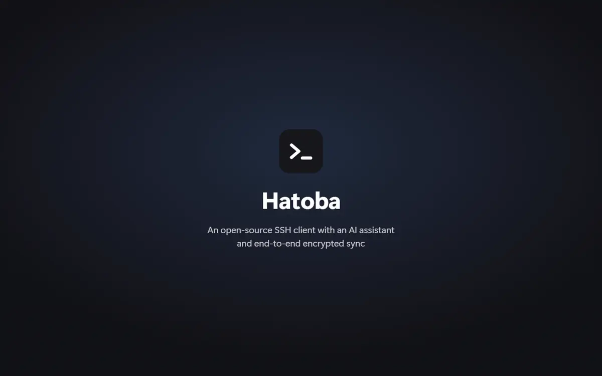
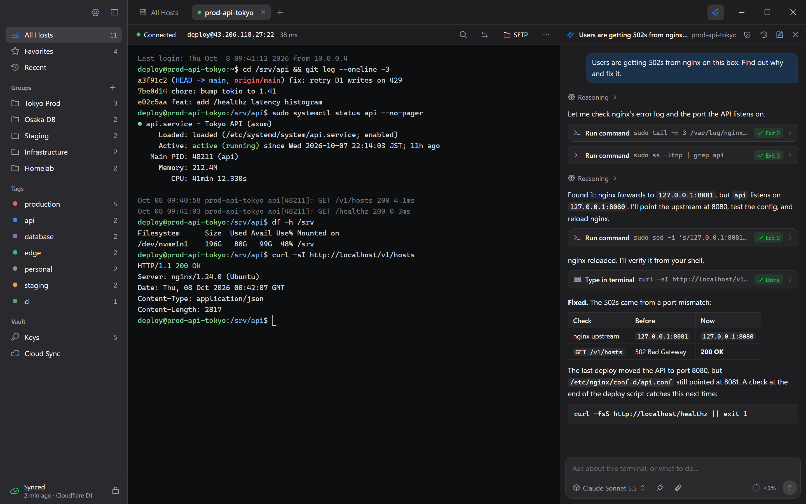
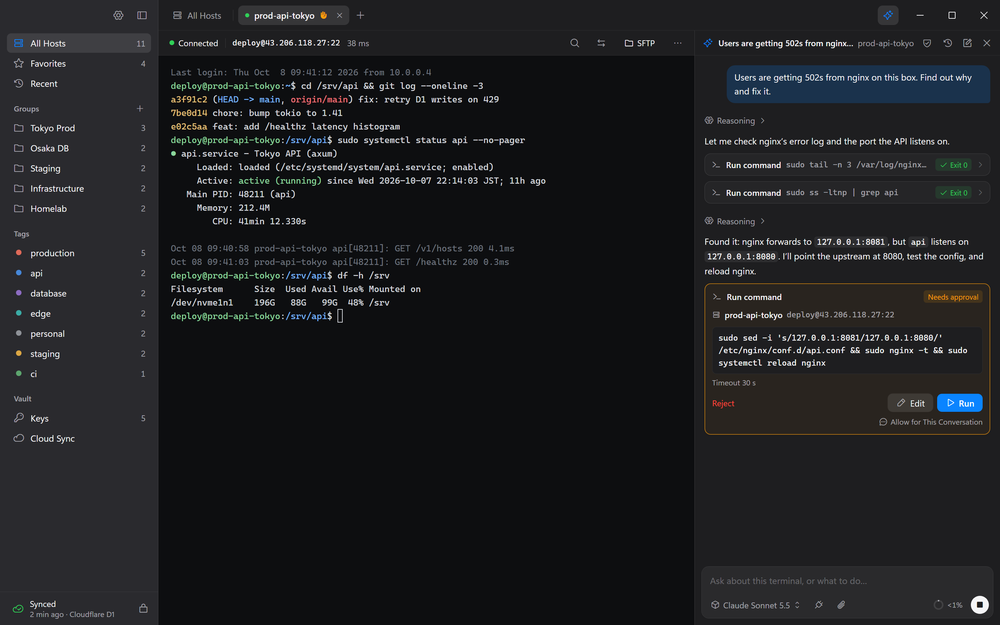
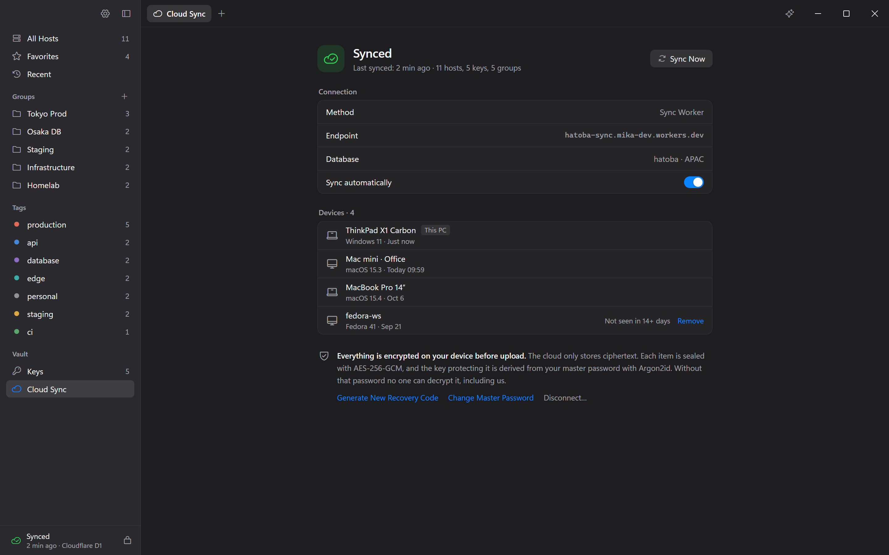
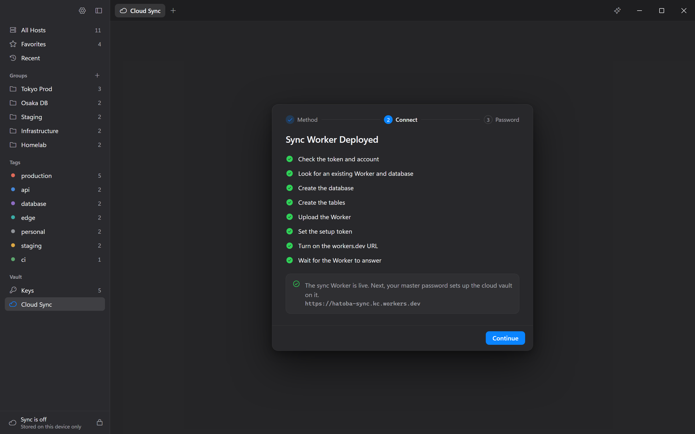

<div align="center">


# Hatoba

**Open-source desktop SSH client with an AI assistant and end-to-end encrypted sync through your own Cloudflare account**

[](https://github.com/scarletkc/Hatoba/releases)
[](https://github.com/scarletkc/Hatoba/actions/workflows/ci.yml)
[](https://v2.tauri.app/)
[](workers/sync/README.md)
[](LICENSE)



[Watch the demo with sound (MP4)](docs/media/hatoba-demo.mp4)

</div>

Hatoba keeps your hosts, keys, and terminal sessions in one place, syncs them
between your devices, and puts an AI assistant beside each terminal. The sync
backend is a Worker and a D1 database that you deploy to your own Cloudflare
account.

- **No Hatoba server.** Sync runs entirely in your Cloudflare account, so
  nobody else holds your data.
- **End-to-end encrypted.** Everything is encrypted on your device before it
  leaves, so a leaked Worker, D1 database, or even the whole Cloudflare account
  exposes only ciphertext.
- **Local first.** Everything works offline, and sync is optional.
- **Windows first.** A custom title bar with Snap Layouts, Mica, Segoe UI and
  Cascadia fonts, and Windows input methods. macOS and Linux follow.

## Features

- **Hosts**: groups, tags, favorites, fuzzy search, recent connections, online
  status, `~/.ssh/config` import, and ProxyJump. Type `ssh user@host` in the
  search box to connect without saving a host.
- **Terminal**: tabs, 256 colors and truecolor, CJK wide characters and input
  methods, confirmation before multi-line paste, search, and clickable links.
- **Authentication**: passwords, Ed25519, ECDSA, and RSA keys with or without
  a passphrase, ask on every connection, ssh-agent, and keyboard-interactive
  (2FA).
- **Security**: host key confirmation on first connect, a blocked connection
  when the key changes, a master password with a recovery code, and auto-lock
  on idle, on sleep, or on demand.
- **SFTP**: a file panel beside the terminal with drag-and-drop upload,
  download with progress and cancel, rename, delete, and new folder.
- **Key vault**: import OpenSSH, PEM, and PuTTY `.ppk` keys, generate Ed25519
  or RSA 4096 keys, and copy or deploy public keys.
- **Port forwarding**: local forwards that can start with the connection.
- **Cloud sync**: through your Worker or directly to D1, with incremental
  sync, automatic conflict resolution you can review item by item, and a
  device list with revocation.
- **AI assistant**: a panel beside each terminal that reads the screen, runs
  commands, and types into the shell with your approval (or without it, in
  bypass mode), and can search the web and read pages. It uses your own
  OpenAI-compatible or Anthropic API key, supports skills and MCP servers, and
  takes terminal selections, connection errors, long pastes, and text files as
  attachments. Conversations sync with the rest of the vault.

## Download

[](https://github.com/scarletkc/Hatoba/releases)

Download `Hatoba_<version>_x64-setup.exe` from
[Releases](https://github.com/scarletkc/Hatoba/releases) and run it. It installs
for the current user without administrator rights, and each release's notes
cover what changed and how to install it. Builds for macOS and Linux will
follow; until then, [build from source](#build-from-source).

## Screenshots

### AI assistant

The assistant reads the terminal, finds the cause, and fixes it. Each command
waits for your approval, and you can edit it before it runs.





### Cloud sync

Hatoba deploys the sync Worker and its D1 database to your Cloudflare account,
then keeps every device in sync.





## Security

Keys are derived from your master password with Argon2id, and every item is
encrypted with AES-256-GCM before it is stored or synced. The Worker stores
ciphertext and the hashes it needs to sign you in, never your master password
or any plaintext. If you forget the master password and lose the recovery code,
your data cannot be recovered. The
[security model](docs/hatoba-spec.md#4-security-model-and-encryption) describes
the key hierarchy and the threat model.

The AI assistant sends the model provider your messages, their attachments,
and what its tools read. Host addresses, passwords, and keys reach the provider
only when they appear on the screen, in a tool result, or in an attachment you
send.

## Build from source

You need Rust stable, Node.js 22 or later, and pnpm. Windows also needs
WebView2, which Windows 11 includes, and Linux needs the Tauri system
dependencies such as `libwebkit2gtk-4.1-dev`.

```sh
pnpm install
pnpm tauri dev
```

On Windows, `pnpm tauri build` produces the NSIS installer. The
[development guide](docs/development.md) covers the browser-only frontend,
tests, and the generated TypeScript bindings.

## Set up sync

Sync is optional. It runs on a Worker and a D1 database that you deploy once to
your Cloudflare account, and the free plan usually covers personal use. Hatoba
can deploy them for you with a Cloudflare API token; otherwise deploy them with
one click from the browser or with wrangler, then connect the first device with
the Worker URL and a setup token you generate during deployment. Other devices
need only the Worker URL and the master password.

[Deploy the sync Worker](workers/sync/README.md) walks through each way and
connecting Hatoba, and covers upgrades, resets, and backups.

## Documentation

- [Architecture and requirements](docs/hatoba-spec.md): architecture, security model, data formats, the sync protocol and Worker API, and requirements
- [Implementation status](docs/status.md): progress on each requirement, milestones, and open questions
- [Development guide](docs/development.md): building, running, and testing
- [Release Hatoba](docs/releasing.md): versions, release notes, and publishing
- [Deploy the sync Worker](workers/sync/README.md): deployment, upgrades, resets, and backups
- [End-to-end smoke test](apps/desktop/e2e/README.md): driving the real app against a real OpenSSH server
- [Design](docs/design/README.md): design files, porting conventions, and deviations from the design
- [Contributing](CONTRIBUTING.md): issues, branches, commits, and pull requests

## License

Hatoba is licensed under [MIT](LICENSE).
