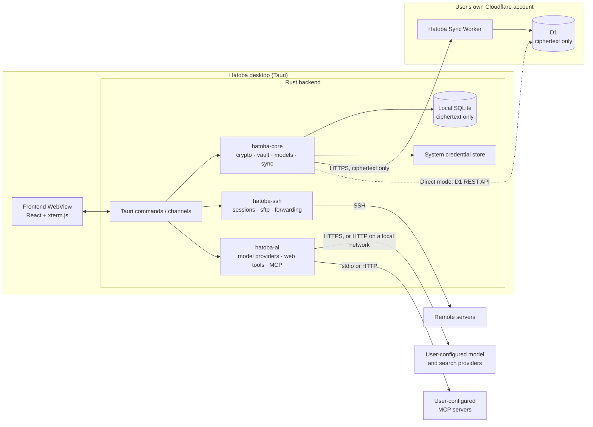

# Hatoba architecture and requirements

## 0. Scope and conventions

This document defines Hatoba's feature scope, architecture, data formats, sync protocol, and security model, and the implementation follows it. Progress on each requirement is tracked in [Implementation status](status.md).

Visuals and interaction follow the Claude Design files, which the [design notes](design/README.md) describe along with the porting conventions. When the design and this document disagree, the design wins on visuals, layout, and copy, and this document wins on behavior, data, and security. When the design lacks an element this document requires (for example the setup token field, the sync conflict states, or the settings pages), add it in the design's visual style.

**Windows is the first platform.** The design has a macOS look. The Windows version adapts it as described in §9.1 (title bar, fonts, shortcuts, and so on) and keeps the overall style. The macOS version (P1) follows the design as is.

Priorities: **P0** is required for the MVP, **P1** for the first public release, and **P2** for later releases.

---

## 1. Product overview

Hatoba is an open-source desktop SSH client, similar in scope to Termius: it keeps hosts, keys, and terminal sessions in one place. It differs from similar products in three ways:

1. **The sync backend runs in the user's own Cloudflare account** (Worker + D1), with no dependency on any official Hatoba server.
2. **End-to-end encryption.** All data is encrypted on the client before it leaves the device. A leak of the Worker, the D1 database, or even the whole Cloudflare account exposes no plaintext.
3. **A minimal, Apple-style interface** built for developers who use it heavily every day, with medium-to-high information density.

### 1.1 Target users

Individual developers, indie developers, and operators who manage several VPSs.

---

## 2. Tech stack

| Layer | Choice | Notes |
|---|---|---|
| Desktop shell | Tauri 2 | **Windows first** (WebView2), then macOS and Linux |
| Frontend | React + TypeScript + Vite | Zustand for state management |
| Terminal rendering | `@xterm/xterm` | Addons: `addon-fit`, `addon-webgl`, `addon-search`, `addon-web-links` |
| IPC types | tauri-specta | Generates TypeScript bindings from Rust instead of hand-written types |
| Backend runtime | Rust stable + tokio | |
| SSH | `russh` | Connections, authentication, PTY, direct-tcpip (jump hosts and port forwarding) |
| SFTP | `russh-sftp` | |
| Key parsing and generation | russh's `keys` module (`ssh-key`) | OpenSSH and PEM formats, including passphrase-protected keys. `crates/hatoba-ssh/src/ppk.rs` parses PuTTY `.ppk` |
| Cryptography | `argon2`, `hkdf`, `sha2`, `aes-gcm`, `rand`, `zeroize` | All in Rust |
| Local storage | `rusqlite` (bundled) | |
| System credential store | `keyring` (Windows Credential Manager, macOS Keychain) | Windows Hello uses the `windows` crate. Touch ID on macOS will use `security-framework` |
| Windows window effects | `window-vibrancy` | Mica backdrop on Windows 11 |
| HTTP | `reqwest` (rustls) | |
| MCP client | `rmcp`, the official Rust SDK | Client features only, used inside `hatoba-ai` (§13.9) |
| Logging | `tracing` | |
| Sync service | Cloudflare Workers (TypeScript) + D1 | Hono for routing, wrangler for deployment |

---

## 3. Architecture

### 3.1 Overview



### 3.2 Core principles

1. **Secrets exist only inside the Rust process.** The WebView never receives the vault key, private keys, or host passwords in plaintext. The frontend receives only the metadata it displays (host names, addresses, tags, fingerprints, and booleans such as `has_password`). A password typed into a form goes one way to Rust and is never sent back to the frontend.
2. **Local first.** Every read and write goes to the local SQLite database first, and sync runs in the background. Without a network, or without sync configured, every feature works.
3. **Local and cloud data use the same ciphertext format.** The local database also stores only ciphertext, which is decrypted in memory after unlock.
4. **`hatoba-core` does not depend on Tauri**, so a future mobile app can reuse it.

### 3.3 Repository layout

```
hatoba/
├── apps/desktop/
│   ├── src/                  # Frontend
│   │   ├── app/              # Layout, routing
│   │   ├── features/         # onboarding, unlock, hosts, terminal, sftp, keys, sync, settings, ai
│   │   ├── components/       # Shared components ported from the design
│   │   ├── styles/           # Design tokens (CSS variables, light and dark)
│   │   ├── i18n/             # Message tables
│   │   └── ipc/              # tauri-specta bindings, frontend contract, browser mock backend
│   ├── src-tauri/            # Tauri shell: commands, channels, capabilities
│   └── e2e/                  # WebDriver end-to-end smoke test
├── crates/
│   ├── hatoba-ai/            # Model provider adapters, MCP client, web search, URL fetching
│   ├── hatoba-core/          # Crypto, vault, data model, local store, sync engine
│   └── hatoba-ssh/           # SSH sessions, PTY, SFTP, port forwarding, known_hosts
├── workers/sync/             # Cloudflare Worker source, D1 migrations, deployment guide
└── docs/
```

### 3.4 Mobile readiness

There is no mobile app yet. A later one could use Tauri 2 mobile, or Flutter calling `hatoba-core` through flutter_rust_bridge. `hatoba-core` must therefore not take on desktop-only dependencies, and platform capabilities (keychain, biometrics) are injected through traits.

---

## 4. Security model and encryption

### 4.1 Key hierarchy

```
master password
 └─ Argon2id(kdf_salt, m=64 MiB, t=3, p=4) → master_key (32B)
     ├─ HKDF-SHA256(info="hatoba/enc/v1")  → enc_key  (32B)  used only on the client
     └─ HKDF-SHA256(info="hatoba/auth/v1") → auth_key (32B)  sent to the Worker to sign in

vault_key (32B, random)
 ├─ AES-256-GCM(enc_key)      → protected_vault_key   stored locally and in the cloud
 └─ AES-256-GCM(recovery_key) → recovery_vault_key    stored locally and in the cloud

recovery_code (128 random bits, shown to the user once)
 ├─ HKDF-SHA256(info="hatoba/recovery/v1")      → recovery_key
 └─ HKDF-SHA256(info="hatoba/recovery-auth/v1") → recovery_auth

each item → AES-256-GCM(vault_key)
```

- KDF parameters are stored as JSON in `kdf_params` (including the algorithm name and version), so the parameters can change later without old data getting stuck.
- The client enforces minimum KDF parameters and rejects anything below them, whether it comes from the Worker or the local database. `KdfFloor::PRODUCTION` in `crates/hatoba-core/src/crypto.rs` defines the minimums.
- The recovery code gets a 32-bit checksum and is shown as 8 groups of 4 Crockford Base32 characters, which is easy to write down and lets the app check what the user types. `crates/hatoba-core/src/recovery.rs` implements the format.
- Changing the master password only generates a new salt and re-encrypts `protected_vault_key`. **No data item is re-encrypted.**
- The server stores only `SHA-256(auth_key)` and `SHA-256(recovery_auth)`. Both inputs have high entropy, so SHA-256 is enough. Getting the master password back from them still means trying candidates through Argon2id one by one.

### 4.2 Encryption format (envelope)

```json
{ "v": 1, "n": "<base64, 12-byte random nonce>", "c": "<base64, ciphertext + GCM tag>" }
```

- Every encryption generates a new random nonce.
- The AAD is the UTF-8 string `hatoba/item/v1/{item_id}`, so ciphertext moved onto a different item fails to decrypt.
- The plaintext is the item's JSON (see §5.1), which includes the `type` field. **The item type never appears in plaintext in any storage.**

### 4.3 Runtime security

| ID | Requirement | Priority |
|---|---|---|
| SEC-01 | After unlock, vault_key and decrypted items live only in Rust memory and are cleared with zeroize on lock | P0 |
| SEC-02 | Auto-lock: idle timeout (15 minutes by default, configurable), system sleep, and manual lock (Ctrl+Shift+L) | P0 |
| SEC-03 | By default, established SSH sessions stay connected while locked, and the UI is covered. A setting disconnects them on lock instead | P0 |
| SEC-04 | Logs must never contain passwords, private keys, the vault key, session tokens, terminal content, AI provider API keys, MCP server environment and header values, MCP server stderr, or AI conversation content (messages, tool inputs, and tool results) | P0 |
| SEC-05 | Tauri hardening: CSP `default-src 'self'`, no remote content, least-privilege capabilities, devtools disabled in release builds, and no shell plugin | P0 |
| SEC-06 | Increasing delay after repeated local unlock failures: no delay for the first 3, then doubling each time up to 5 minutes (`unlock_delay_ms` in `crates/hatoba-core/src/vault.rs`). The failure count is persisted and survives an app restart. Argon2id does not run during the delay | P0 |
| SEC-07 | Windows Hello unlock: create a Hello credential with `KeyCredentialManager`, sign a fixed challenge, derive a wrapping key from the signature with HKDF, encrypt vault_key with it, and store the ciphertext in Credential Manager. A `UserConsentVerifier` prompt alone does not meet the requirement, because it has no cryptographic binding to vault_key | P1 |
| SEC-08 | Clear the clipboard 30 seconds after a password is copied | P1 |
| SEC-09 | Show password strength (zxcvbn) when setting the master password | P1 |
| SEC-10 | Touch ID unlock (with the macOS version): store vault_key in the macOS Keychain with biometric access control | P2 |

### 4.4 Threat model

| Scenario | Outcome |
|---|---|
| The Cloudflare account, Worker, or D1 is stolen or exported | The attacker gets only ciphertext and KDF parameters and has to brute-force the master password through Argon2id |
| Network man-in-the-middle | Traffic uses HTTPS. Even if that is broken, the content is ciphertext |
| Maliciously modified Worker code | It cannot decrypt data, but it can delete data, roll it back to an older version, or deny service. Local copies are unaffected. Rollback detection is P2 |
| The Cloudflare API token used for in-app deployment leaks | It can change or delete every Worker and D1 database in the accounts it reaches, including the sync data, and can replace the Worker with modified code (the row above). The app holds it only in memory during a deployment (§6.7) and never stores it, so a stolen device or local database does not expose it. The token is safest with only the two permissions in §6.7, one account, and a short expiry, or deleted after the deployment |
| A malicious Worker reads `auth_key` during sign-in | `enc_key` and `vault_key` cannot be derived from `auth_key` (the one-way derivation in §4.1) |
| A malicious Worker returns weakened KDF parameters from `/v1/prelogin` | The client refuses to sign in, per the minimums in §4.1 |
| Someone holds a valid full session token | They can change the master password (`PUT /v1/vault/password` does not ask for the old one). After losing a device, revoke it from another device and consider changing the master password |
| Someone holds the recovery code | That equals holding the whole vault: the code decrypts `vault_key` and can reset the master password through `/v1/recover` |
| Text on the screen, in command output, or in a fetched page steers the AI assistant (prompt injection) | In manual approval mode, every command, terminal input, and URL waits for the user, and only `web_search` queries leave without asking, to the search provider the user chose. In bypass mode the assistant can run what it is steered to on the tab's host, and `fetch_url` can carry data out in the URL it fetches. Bypass is chosen per device and per conversation (§13.5) |
| The AI model provider leaks or keeps conversation data | It holds what the assistant sent it: messages, screen text, and tool results (§13.1). Of the vault, only the tab host's display name and user name reach it, and the skills the assistant lists or reads (§13.8) |
| A `stdio` MCP server, or an imported skill, is malicious | A `stdio` server runs with the user's privileges, so adding one is like installing software, and the settings show its full command line before it is saved. MCP tool descriptions and skill text reach the model as instructions, so settings and import show them in full, and MCP tool results are treated as data like terminal output (§13.8, §13.9) |
| The device is compromised while unlocked | Out of scope |
| The master password is forgotten and the recovery code is lost | The data cannot be recovered. This is by design, and the UI must say so clearly |

### 4.5 Data visible to the server

The columns the server stores are defined by the migrations in §5.3, where items and device names are §4.2 envelopes.

**The server cannot see**: the master password, `master_key`, `enc_key`, `vault_key`, the recovery code, any item plaintext, or item types (the type is inside the encrypted plaintext).

**Metadata the server can see**: the number of items, their IDs, ciphertext sizes, modification times, the number of devices, sign-in and sync times, and the IP addresses Cloudflare sees anyway. AI conversations add items as they grow (§13.7), so these numbers also show when and how much the assistant is used.

---

## 5. Data model

### 5.1 Item types (plaintext before encryption)

All item IDs are UUIDv7. Reading plaintext tolerates unknown and missing fields, so different app versions can read each other's data. The Rust implementation is `Item` in `crates/hatoba-core/src/model.rs`.

```ts
type Item =
  | Host | Group | SshKey | KnownHost | PortForward | Snippet
  | AiProvider | SearchProvider | AiConversation | AiMessage
  | Skill | SkillFile | McpServer
  | Settings;

interface Host {
  type: "host";
  name: string;                 // Display name, such as prod-api-tokyo
  address: string;              // Domain name or IP
  port: number;                 // 22 by default
  username: string;
  auth:
    | { kind: "password"; password: string }
    | { kind: "key"; key_id: string }
    | { kind: "agent" }         // P1
    | { kind: "ask" };          // Ask on every connection
  group_id: string | null;
  tags: string[];               // Such as ["production", "tokyo"]
  favorite: boolean;
  jump_host_id: string | null;  // P1, ProxyJump
  note: string;
  updated_at: number;           // Milliseconds since the epoch, used for conflict resolution
}

interface Group {
  type: "group";
  name: string;
  parent_id: string | null;     // The MVP supports one level of nesting
  sort: number;
  updated_at: number;
}

interface SshKey {
  type: "key";
  name: string;
  algorithm: "ed25519" | "ecdsa" | "rsa";
  private_key: string;          // OpenSSH format
  passphrase: string | null;    // Key passphrase, if any
  public_key: string;
  fingerprint: string;          // SHA256:...
  comment: string;
  created_at: number;
  updated_at: number;
}

interface KnownHost {
  type: "known_host";
  host: string;
  port: number;
  key_type: string;
  public_key: string;
  fingerprint: string;
  first_seen_at: number;
  updated_at: number;
}

interface PortForward {          // P1
  type: "forward";
  host_id: string;
  kind: "local" | "remote" | "dynamic";
  bind_address: string;
  bind_port: number;
  dest_host: string | null;     // null for dynamic
  dest_port: number | null;
  auto_start: boolean;
  updated_at: number;
}

interface Snippet {              // P2
  type: "snippet";
  name: string;
  command: string;
  tags: string[];
  updated_at: number;
}

interface AiProvider {           // P1, §13.2
  type: "ai_provider";
  name: string;
  protocol: "chat_completions" | "anthropic";  // Read as chat_completions when missing
  base_url: string;             // Such as https://api.openai.com/v1 or https://api.anthropic.com
  api_key: string;              // Empty when the server needs none
  auth_header: "x-api-key" | "authorization";  // anthropic only
  models: {
    id: string;                 // Model ID sent in requests
    name: string;               // Display name
    context_window: number | null;     // Tokens, null when unknown
    max_output_tokens: number | null;  // Tokens, null when unknown
  }[];
  updated_at: number;
}

interface SearchProvider {       // P1, the backend of web_search (§13.4)
  type: "search_provider";
  kind: "brave" | "tavily" | "searxng";
  base_url: string | null;      // The instance URL for searxng, null otherwise
  api_key: string;              // Empty for searxng
  updated_at: number;
}

interface AiConversation {       // P1, §13.7
  type: "ai_conversation";
  title: string;
  host_id: string | null;       // The host the conversation last worked on
  pinned: boolean;
  context_start: string | null; // entry_id where the context sent to the model starts (AI-21)
  created_at: number;
  updated_at: number;
}

interface AiMessage {            // P1, one part of a conversation entry (§13.7)
  type: "ai_message";
  conversation_id: string;
  entry_id: string;             // UUIDv7, orders the entries of a conversation
  part: number;                 // 0-based
  part_count: number;
  data: string;                 // This part's slice of the entry's JSON
  updated_at: number;
}

interface Skill {                // P2, §13.8
  type: "skill";
  name: string;                 // 1 to 64 lowercase letters, digits, and hyphens
  description: string;          // At most 1,024 characters
  frontmatter: Record<string, unknown>;  // Other SKILL.md frontmatter fields, kept for export
  enabled: boolean;
  updated_at: number;
}

interface SkillFile {            // P2, one text file of a skill (§13.8)
  type: "skill_file";
  skill_id: string;
  path: string;                 // "SKILL.md" (its body, without frontmatter) or a relative path such as references/nginx.md
  content: string;              // UTF-8 text, at most 32 KB
  updated_at: number;
}

interface McpServer {            // P2, §13.9
  type: "mcp_server";
  name: string;                 // Used in tool names
  transport:
    | { kind: "stdio"; command: string; args: string[]; env: Record<string, string> }
    | { kind: "http"; url: string; headers: Record<string, string> };
  always_ask: boolean;          // Ask even in bypass mode (AI-31)
  updated_at: number;
}

interface Settings {             // Fixed ID "settings", a single item
  type: "settings";
  terminal: {
    font_family: string;
    font_size: number;
    theme: "system" | "light" | "dark";
    cursor_style: "block" | "bar" | "underline";
    scrollback: number;         // 10000 by default
    right_click?: "copy_paste" | "menu"; // WIN-05, "copy_paste" while absent
    confirm_multiline_paste?: boolean;   // TERM-04, true while absent
  };
  auto_lock_minutes: number;
  lock_disconnects_sessions: boolean;
  ai: {                         // P1, §13
    default_model: { provider_id: string; model_id: string } | null;
    search_provider_id: string | null;
  };
  updated_at: number;
}
```

`terminal.right_click` and `terminal.confirm_multiline_paste` were device-local in earlier versions, which do not write them. Each stays absent until it is set to a value other than its default. After the upgrade, each device moves its own values into the fields that are still absent, under the same rule, and does this once. With sync off, the move happens right after unlock. With sync on, it waits for the first successful sync round after unlock, so it changes the latest `Settings` the server had: a value already set there is kept, and edits other devices had already uploaded are not outdated by the move's newer `updated_at` (§6.4). Until then the values stay in the device-local preferences. The move then uploads like any other edit.

Device-local data such as the last connection time and the window size is **not synced**. Otherwise every connection would cause a write and a potential conflict.

### 5.2 Local SQLite

The local database is `vault.db` in the app's local data directory, with SQLite's `vault.db-wal` and `vault.db-shm` beside it:

| Platform | Location |
|---|---|
| Windows | `%LOCALAPPDATA%\app.hatoba.desktop\vault.db`, next to the `logs` folder |
| macOS | `~/Library/Application Support/app.hatoba.desktop/vault.db` |
| Linux | `$XDG_DATA_HOME/app.hatoba.desktop/vault.db`, by default `~/.local/share/app.hatoba.desktop/vault.db` |

The database holds device-local data (the device ID, the sync cursor, the local preferences, and `local_state`), so it must not live in a directory that roams with the user profile. On Windows that rules out `%APPDATA%`: roaming profiles copy it to other machines, which would then share one device ID, and it is often redirected to a network share, where SQLite's WAL is unreliable.

`MIGRATIONS` in `crates/hatoba-core/src/store.rs` defines the tables, and the `meta` module in the same file lists the keys of the `meta` table. The tables hold:

- `meta`: key-value pairs for the KDF parameters, the wrapped vault key, the device ID, the sync cursor, and so on.
- `items`: one row per item. `envelope` holds only the §4.2 envelope and becomes NULL after deletion (a tombstone). `revision` is the version the server has confirmed, 0 for items that were never synced. `dirty` marks local changes that have not been pushed yet.
- `local_state`: device-local data that is not synced, such as the last connection time.
- `conflict_log`: conflicts resolved automatically under §6.4, kept for item-by-item review and restore.

The sync session token and the Cloudflare API token of D1 direct mode live in the system credential store (Windows Credential Manager). They are never written to SQLite and never synced. The API token for in-app deployment and the setup token the app generates are not stored anywhere (§6.7). For a Worker the app deployed, the sync backend setting in `meta` also records the account ID and the Worker name, which are not secrets and only fill in the upgrade form.

### 5.3 D1 schema

One Worker deployment serves one user (a single vault). The migrations in `workers/sync/migrations/`, applied in file-name order starting with `0001_init.sql`, define the schema, which the Worker and D1 direct mode share:

- `meta`: a single row (`id = 1`) with the KDF parameters, `SHA-256(auth_key)`, `SHA-256(recovery_auth)`, the two wrapped vault keys, and the global `seq`.
- `items`: item envelopes, `revision`, `seq`, the deletion flag, and the update time. `seq` increases globally and drives incremental pulls.
- `sessions`: used only in Worker mode. It stores `SHA-256(session_token)`, the device ID, the device name encrypted with vault_key, and the session `scope` (full session or recovery session).

---

## 6. Sync

### 6.1 Two sync backends

The client abstracts the sync backend behind the `SyncBackend` trait, so the sync engine does not care which implementation it talks to.

```rust
#[async_trait]
pub trait SyncBackend {
    async fn health(&self) -> Result<ServerInfo>;
    async fn prelogin(&self) -> Result<KdfInfo>;
    async fn setup(&self, init: VaultInit) -> Result<()>;
    async fn login(&self, auth_key: &[u8], device: DeviceInfo) -> Result<Session>;
    async fn fetch_vault(&self) -> Result<VaultMeta>;
    async fn pull(&self, since_seq: u64, limit: u32) -> Result<PullPage>;
    async fn push(&self, changes: Vec<Change>) -> Result<Vec<PushResult>>;
    async fn update_vault_meta(&self, update: VaultMetaUpdate) -> Result<()>;
}
```

**Worker mode (P0, recommended)**: the user deploys `workers/sync` to their own Cloudflare account, and the client calls the §6.2 API over HTTPS.

**D1 direct mode (P1)**: the user enters an Account ID and an API token and picks one of the account's D1 databases. The client runs SQL directly through `POST https://api.cloudflare.com/client/v4/accounts/{account_id}/d1/database/{database_id}/query`. The schema is the same as in Worker mode (without the `sessions` table), and concurrent writes are detected by running `UPDATE ... WHERE revision = ?` and checking the affected row count. In this mode the API token usually has edit access to every D1 database in the account. The UI must explain this risk, and the token is stored only in the device's credential store.

### 6.2 Worker API

All endpoints live under `/v1`. Requests and responses are JSON (`Content-Type: application/json`, anything else gets `415`). Endpoints that need a session take `Authorization: Bearer <session_token>`.

#### Conventions

- All timestamps are Unix milliseconds (matching `updated_at` in item plaintext), including `created_at`, `last_seen`, and `expires_at`.
- `auth_key`, `recovery_auth`: 32 bytes in **standard base64 (with `=` padding)**. The client sends the raw value, and the server stores its `SHA-256` (hex).
- `kdf_params`: a **JSON string** (the client serializes the parameter object to a string). The server stores and returns it unchanged without interpreting it. It must be a JSON object of at most 1 KB.
- `kdf_salt`: an opaque string of 16 to 256 characters (`A-Za-z0-9+/_=-`). The server does not decode it.
- `protected_vault_key`, `recovery_vault_key`, `device_name`, and item `envelope`: opaque strings stored as is, at most 4 KB, 4 KB, 4 KB, and 64 KB respectively (in UTF-8 bytes).
- `device_id` and item `id`: `[A-Za-z0-9_-]`, 1 to 64 characters (UUIDs and the literal `settings` both qualify).
- Error responses: `{ "error": "<code>", "message": "..." }`. `message` may be omitted and never echoes submitted values.

#### Endpoints

| Method | Path | Auth | Description |
|---|---|---|---|
| GET | `/v1/health` | None | `{ service: "hatoba-sync", version, api: 1, initialized }`, used by **Test Connection** in the wizard. `503 database_unavailable` when D1 is unavailable or not migrated |
| GET | `/v1/prelogin` | None | `{ kdf_salt, kdf_params }`. `404 not_initialized` before setup |
| POST | `/v1/setup` | Setup token | Initializes meta for the first time. `201 { initialized: true }` on success, `409 already_initialized` if already set up, `401 invalid_setup_token` for a wrong token, `503 setup_token_not_configured` when none is configured |
| POST | `/v1/login` | None | `{ auth_key, device_id, device_name }` → `{ session_token, expires_at }` |
| POST | `/v1/recover` | None | `{ recovery_auth, device_id, device_name }` → `{ recovery_vault_key, kdf_salt, kdf_params, session_token, expires_at }` (recovery session) |
| GET | `/v1/vault` | Full session | `{ schema_version, kdf_salt, kdf_params, protected_vault_key, recovery_vault_key, seq }` |
| GET | `/v1/items?since=&limit=` | Full session | Incremental pull: `{ items, next_since, has_more }` |
| POST | `/v1/items` | Full session | Batch push: `{ changes: [...] }` → `{ results: [...] }` |
| PUT | `/v1/vault/password` | Full or recovery session | Changes the master password: atomically updates meta and revokes sessions. `200 { ok, relogin_required }` on success |
| GET | `/v1/devices` | Full session | `{ devices: [{ device_id, device_name, created_at, last_seen, expires_at, current }] }` |
| DELETE | `/v1/devices/:device_id` | Full session | Revokes that device's session with `204`. A device can revoke itself, and an unknown device also gets `204` |

#### Server requirements

- **Setup token**: set at deployment as the Worker secret `SETUP_TOKEN`, with `wrangler secret put SETUP_TOKEN` or by the app (§6.7). It stops someone else from initializing a freshly deployed, unconfigured Worker before you do. Without the token, `/v1/setup` always refuses (`401`), and it returns `503` when the secret is not configured. The secret can be deleted after initialization. The comparison runs in constant time, and so does the `auth_hash` comparison.
- **Sessions**: a token is 32 random bytes (base64url), and D1 stores only its SHA-256. It is valid for 30 days and slides forward on use (the renewal is written at most once a minute). Each device (`device_id`) keeps only one session of each kind.
- **Recovery sessions**: a session issued by `/v1/recover` is valid for 15 minutes and can call only `PUT /v1/vault/password`. Other endpoints return `403`.
- **Rate limits**: `/v1/setup`, `/v1/login`, and `/v1/recover` allow 10 requests per minute for each source IP and endpoint, through the Workers Rate Limiting binding, and return `429` beyond that. Each Cloudflare data center counts separately.
- **Size limits**: at most 100 changes per push, and at most 64 KB per envelope.
- **No CORS headers**: client requests come from Rust, not a browser, so third-party web pages in a browser cannot call the Worker cross-origin.
- **No secrets in logs**: tokens, `auth_key`, envelopes, and request bodies are never logged. Every response carries `Cache-Control: no-store`.

#### POST /v1/setup

```http
POST /v1/setup
Authorization: Bearer <SETUP_TOKEN>
Content-Type: application/json

{
  "schema_version": 1,
  "kdf_salt": "<opaque salt>",
  "kdf_params": "{\"alg\":\"argon2id\",\"v\":1,...}",
  "auth_key": "<base64, 32 bytes>",
  "protected_vault_key": "<envelope>",
  "recovery_vault_key": "<envelope>",
  "recovery_auth": "<base64, 32 bytes>"
}
```

#### GET /v1/items

Incremental pull by `seq`: `SELECT * FROM items WHERE seq > :since ORDER BY seq LIMIT :limit`. `since` defaults to 0. `limit` defaults to 500 with a maximum of 1000 (larger values are capped at 1000). Invalid values return `400`.

```json
{
  "items": [
    { "id": "0192...", "envelope": "{\"v\":1,...}", "revision": 4, "seq": 1207, "deleted": false, "updated_at": 1790000000000 }
  ],
  "next_since": 1207,
  "has_more": false
}
```

`next_since` is the `seq` of the last item on the page (the given `since` for an empty page). Deleted items are tombstones: `deleted: true, envelope: null`.

#### POST /v1/items

```json
{ "changes": [
  { "id": "0192...", "base_revision": 3, "deleted": false, "envelope": "{\"v\":1,...}", "updated_at": 1790000000000 }
]}
```

- `base_revision = 0` means create. Otherwise it must equal the item's revision on the server (optimistic concurrency).
- Delete: `deleted: true` with `envelope` set to `null` (or omitted). A change that is not a deletion needs a non-empty `envelope` string.
- `updated_at` is optional. The server time is used when it is omitted.
- At most 100 changes per request, and more return `413 too_many_changes`. The same `id` cannot appear twice in one request.

The server runs one D1 batch per change (D1 executes a batch as a transaction):

1. `UPDATE meta SET seq = seq + 1 WHERE id = 1`
2. If `base_revision = 0`, run `INSERT ... ON CONFLICT(id) DO NOTHING`, and the new item gets `revision = 1`. Otherwise run `UPDATE items SET envelope = ?, deleted = ?, revision = revision + 1, seq = (SELECT seq FROM meta WHERE id = 1), updated_at = ? WHERE id = ? AND revision = ?`
3. Zero affected rows means a conflict, and the server reads the item's row and returns it to the client.

`results` follow the request order:

```json
{ "results": [
  { "id": "0192...", "status": "ok", "revision": 4, "seq": 1207 },
  { "id": "0193...", "status": "conflict",
    "server": { "revision": 6, "seq": 1190, "deleted": false, "envelope": "...", "updated_at": 1790000000000 } },
  { "id": "0194...", "status": "error", "error": "too_large" },
  { "id": "0195...", "status": "error", "error": "not_found" }
]}
```

| status | Meaning |
|---|---|
| `ok` | Written. Returns the new `revision` and `seq` |
| `conflict` | `base_revision` does not match the server (including a create whose ID already exists). `server` is the item's state on the server (`envelope` is `null` for a tombstone). The client resolves it per §6.4 and retries |
| `error` / `too_large` | A single envelope exceeds 64 KB. **Only this change is affected.** The other changes are processed as usual, so one oversized item does not block the whole push queue |
| `error` / `not_found` | `base_revision > 0`, but the server has no such item (for example after a database reset). The client can upload it again as a new item (`base_revision = 0`) |

`seq` increases monotonically across the vault but may have gaps (a conflicting attempt also uses up a seq). The client relies only on it increasing.

Structural errors (missing fields, wrong types, invalid IDs, `deleted` inconsistent with `envelope`, duplicate IDs) make the **whole request** return `400`, and nothing is written.

#### PUT /v1/vault/password

```json
{
  "kdf_salt": "...", "kdf_params": "{...}",
  "auth_key": "<base64, 32 bytes>",
  "protected_vault_key": "<envelope>",
  "recovery_vault_key": "<envelope>", "recovery_auth": "<base64, 32 bytes>"
}
```

`recovery_vault_key` and `recovery_auth` are either both present (rotating the recovery code) or both absent. Updating `meta` and revoking sessions happen in one transaction:

- Full session: revokes **all other** sessions, and the caller stays signed in (`relogin_required: false`).
- Recovery session: revokes **all** sessions, including the caller's (`relogin_required: true`), and the client must sign in again with the new password.

#### Error codes

| HTTP | `error` | When |
|---|---|---|
| 400 | `invalid_request` / `invalid_json` | Missing field, wrong type or format / JSON that cannot be parsed |
| 401 | `unauthorized` / `invalid_session` | No token / unknown or expired token |
| 401 | `invalid_credentials` | Wrong `auth_key` or `recovery_auth` |
| 401 | `invalid_setup_token` | Missing or wrong setup token |
| 403 | `insufficient_scope` | A recovery session called an endpoint other than `PUT /v1/vault/password` |
| 404 | `not_initialized` / `not_found` | Not set up yet / unknown path |
| 409 | `already_initialized` | Setup called again |
| 413 | `too_many_changes` / `payload_too_large` | More than 100 changes / request body too large |
| 415 | `unsupported_media_type` | The request body is not JSON |
| 429 | `rate_limited` | Rate limit hit (with `Retry-After: 60`) |
| 500 | `internal_error` | Unexpected error (details are not returned to the client) |
| 503 | `setup_token_not_configured` / `database_unavailable` | Secret not set / D1 unavailable or not migrated |

### 6.3 Client sync flow

**When sync runs**: after unlock, after a local change (2-second debounce), every 60 seconds, when the window regains focus, and when the user starts it manually.

**One sync round**:

1. Pull pages starting at `sync_cursor` until `has_more = false`. For each remote item, overwrite the local item if it is not dirty, and resolve the conflict per §6.4 if it is.
2. Push all dirty items. Successful items have dirty cleared and their revision updated. Conflicting items are handled per §6.4 and retried at most once.
3. Update `sync_cursor` and broadcast the sync status to the frontend.

A failed sync does not affect local use. The UI shows **Offline** or **Signed out**, and the next trigger retries automatically with exponential backoff.

### 6.4 Conflict resolution

1. Default rule: decrypt both versions and keep the one with the newer `updated_at` in the plaintext (last writer wins).
2. **Key items (`type = "key"`) are never dropped silently.** The losing version is saved as a new item, with a localized conflict-copy suffix added to its name.
3. When one side deletes an item and the other modifies it, the modification wins (the item comes back), to avoid accidental deletion.
4. Every automatic resolution is written to the local conflict log, and the sync status page shows the number of conflicts. P1 adds item-by-item review: keep the automatic result, or restore the other version.

### 6.5 Tombstones

In the MVP, deleted items keep their tombstones forever (`envelope = NULL, deleted = 1`), which costs little space. P2 may purge tombstones older than 180 days, and a device offline for longer than that would then need a full resync.

### 6.6 Key flows

**Flow A: enable sync on the first device**

1. On first launch, create the local vault: set the master password, generate the recovery code, and have the user confirm it is saved. From here on the app works fully offline.
2. Open **Cloud Sync** in the sidebar, choose Worker mode, enter the Worker URL and the setup token, and select **Test Connection** (which calls `/v1/health`). An in-app deployment (§6.7) supplies the URL and the setup token itself.
3. Call `/v1/setup` to upload meta, then sign in and push all items.

**Flow B: add a new device**

1. On first launch, choose **Restore from Cloud** and enter the Worker URL.
2. Call `/v1/prelogin` for the salt and parameters. The user enters the master password, and the client derives the keys and signs in.
3. Pull the vault meta, decrypt vault_key, and then pull every item.

**Flow C: connect an existing local vault to an initialized cloud vault (P1)**

The two sides have different vault_keys and need a merge: decrypt every local item with the local vault_key, re-encrypt it with the cloud vault_key, push it as a new item, and then replace the local meta with the cloud's. The master password becomes the cloud's master password as well. The user must confirm explicitly before this runs. In the MVP, this case only shows the message "The cloud already has a vault. On a new device, choose Restore from Cloud."

**Worker deployment**: the steps are in [Deploy the sync Worker](../workers/sync/README.md), and the in-app sync wizard links to it. One-click deployment inside the app through the Cloudflare API (§6.7) and a Deploy to Cloudflare button are both P1.

### 6.7 In-app deployment

The app can deploy `workers/sync` to the user's Cloudflare account through the Cloudflare API, initialize it, and upgrade it later, so the user needs neither a Git account nor a command line. The user provides only an API token, and the account ID when the app cannot fill it in. The deployment uses the same names, bindings, and migration records as the wrangler path in the [deployment guide](../workers/sync/README.md), so wrangler can maintain an in-app deployment and the app can upgrade a deployment made with wrangler.

| ID | Requirement | Priority |
|---|---|---|
| DEPLOY-01 | Release builds embed the Worker bundle, the migrations, and their manifest, generated from `workers/sync` at build time ([Worker bundle](#worker-bundle)) | P1 |
| DEPLOY-02 | A link opens Cloudflare's token form with the required permissions filled in. The app checks the token and fills in the account ID when the token reveals it, before anything is written ([API token](#api-token)) | P1 |
| DEPLOY-03 | Run the [deployment steps](#deployment-steps) in order with progress for each step, and finish on a Worker that answers `/v1/health` with the bundled version | P1 |
| DEPLOY-04 | Never overwrite a Worker the app does not recognize or a database that holds data ([existing Workers and databases](#existing-workers-and-databases)) | P1 |
| DEPLOY-05 | A retry after a failure at any step continues the deployment, and cleanup removes only what the deployment created ([failures and cleanup](#failures-and-cleanup)) | P1 |
| DEPLOY-06 | The app generates the setup token, passes it to `/v1/setup` itself, and deletes the `SETUP_TOKEN` secret once setup succeeds | P1 |
| DEPLOY-07 | The API token and the setup token live only in Rust memory for the length of the deployment. They are never stored, logged, or sent to the WebView ([token handling](#token-handling)) | P1 |
| DEPLOY-08 | Detect an older Worker through `/v1/health` and offer or require an upgrade through the same steps ([upgrades](#upgrades)) | P1 |

#### Worker bundle

The release build runs `npx wrangler deploy --dry-run --outdir <dir>` in `workers/sync` after `npm ci`. This is the bundling step Cloudflare documents for uploads through the API, and it produces a single ES module, `index.js`. `scripts/worker/bundle.mjs` (`pnpm worker:bundle`) runs both and packages that module with:

- Every `.sql` file in `workers/sync/migrations/`, in file-name order. The file name is the migration's name in `d1_migrations`.
- A manifest with the Worker version, the `name`, `compatibility_date`, and `compatibility_flags` from `workers/sync/wrangler.toml`, and the settings of its `DB` and `AUTH_LIMITER` bindings (the database name, and the rate limit's namespace, limit, and period).

The Rust shell embeds the package in the binary. The package is generated and never committed, and `tauri build` creates it through `beforeBuildCommand`. A build without it, such as `cargo test`, still compiles, and the deploy commands then return an error saying that the build has no Worker bundle.

**Versions.** The Worker version is `version` in `workers/sync/package.json`, which a test keeps equal to `VERSION` in `workers/sync/src/config.ts`, and `/v1/health` reports it as `version`. It is separate from the app version, so an app release that does not touch the Worker asks nobody to redeploy. Any change that alters the bundle or adds a migration (the source, its dependencies, `wrangler.toml`, or `migrations/`) raises the Worker version in the same pull request, and CI fails a change to these files that leaves the Worker version unchanged. The app knows two Worker versions: the bundled version, which is the newest it can deploy, and the minimum version it can sync with.

**Compatibility.** Within one `api` number, Worker changes are additive. A new Worker version still serves apps built against older Worker versions, and a new migration works with the previous Worker code, because an upgrade applies migrations before it uploads the new code.

#### API token

The user creates an API token in the Cloudflare dashboard and pastes it into the wizard. The token needs two permissions:

| Permission in the dashboard | Name in the API reference | Used for |
|---|---|---|
| Account · Workers Scripts · Edit | Workers Scripts Write | Reading the workers.dev subdomain and an existing Worker's settings, creating a workers.dev subdomain, uploading the Worker, setting and deleting its secret, enabling its workers.dev route, and deleting it during cleanup |
| Account · D1 · Edit | D1 Write | Listing, creating, and querying databases (checks and migrations), and deleting a database during cleanup |

The wizard's **Create token** link opens the dashboard's token form with both permissions and a token name filled in. It follows Cloudflare's template URL format for user tokens:

```text
https://dash.cloudflare.com/profile/api-tokens?permissionGroupKeys=%5B%7B%22key%22%3A%22workers_scripts%22%2C%22type%22%3A%22edit%22%7D%2C%7B%22key%22%3A%22d1%22%2C%22type%22%3A%22edit%22%7D%5D&accountId=%2A&zoneId=all&name=Hatoba%20Sync%20Deploy
```

The template allows every account, so the wizard tells the user to narrow **Account Resources** to one account and to set a short expiry, or to delete the token after deploying. An account-owned token with the same permissions also works.

The token check calls `GET /user/tokens/verify` and, when that rejects the token, `GET /accounts/{account_id}/tokens/verify` for an account-owned token, as D1 direct mode does. An account-owned token therefore needs the account ID entered first. For a user token the app then calls `GET /accounts`. When the token reaches exactly one account, the wizard fills in its ID, and when it reaches several, the user picks one. Otherwise the user pastes the ID from the dashboard (**Workers & Pages** → **Account Details**). Step 2 below reads from both Workers and D1, so a missing permission shows up before anything is written, and the error names the permission.

#### Deployment steps

Paths are relative to `https://api.cloudflare.com/client/v4`. `{name}` and `{db}` are the Worker and database names, `hatoba-sync` and `hatoba` by default (the names in `wrangler.toml`), and the wizard lets the user change both in an expandable section.

| # | Step | Cloudflare API | When repeated |
|---|---|---|---|
| 1 | Check the token and the account | `GET /user/tokens/verify` or `GET /accounts/{account_id}/tokens/verify`, then `GET /accounts` | Read only |
| 2 | Inspect the account | `GET /accounts/{account_id}/workers/subdomain`, `GET /accounts/{account_id}/workers/scripts/{name}/settings`, `GET /accounts/{account_id}/d1/database?name={db}`, and read-only queries on any database found | Read only. Picks the plan in [existing Workers and databases](#existing-workers-and-databases) |
| 3 | Create the database | `POST /accounts/{account_id}/d1/database` with `{ "name": "{db}" }` | Skipped when step 2 found a database to use |
| 4 | Apply the migrations | `POST /accounts/{account_id}/d1/database/{database_id}/query` | Applies only the migrations that `d1_migrations` does not list |
| 5 | Upload the Worker | `PUT /accounts/{account_id}/workers/scripts/{name}` (multipart) | Replaces the code and the bindings |
| 6 | Set the setup token | `PUT /accounts/{account_id}/workers/scripts/{name}/secrets` | Runs only while the vault is not initialized, with a new token each time |
| 7 | Enable workers.dev | `POST /accounts/{account_id}/workers/scripts/{name}/subdomain` with `{ "enabled": true, "previews_enabled": false }` | No change when already enabled |
| 8 | Wait for the Worker | `GET https://{name}.{subdomain}.workers.dev/v1/health` | Read only |

- **Step 2**: when the account has no workers.dev subdomain yet, the wizard asks the user to choose one, because it appears in the URL of every Worker in the account, and creates it with `PUT /accounts/{account_id}/workers/subdomain` (`{ "subdomain": "<name>" }`) before step 3. The `name` filter of the database list is a search, so the app uses only an exact match.
- **Step 4**: one query call per missing migration, whose `sql` is the file's content followed by `INSERT INTO d1_migrations (name) VALUES ('<file name>');`. The endpoint runs the statements of one call as a batch, so a migration and its record are applied together. `wrangler d1 migrations apply` uses the same table and the same statement, and the app creates the table with wrangler's columns (`id`, a unique `name`, and `applied_at`) when it is missing, so both tools agree on what has been applied.
- **Step 5**: a `multipart/form-data` upload with a `metadata` part and one module part, `index.js`, of type `application/javascript+module`. The metadata sets `main_module` to `index.js`, the `compatibility_date` and `compatibility_flags` from the manifest, and `keep_bindings: ["secret_text"]`, which keeps any secret the Worker already has. Its `bindings` are `{ "type": "d1", "name": "DB", "database_id": "<database ID>" }` and `{ "type": "ratelimit", "name": "AUTH_LIMITER", "namespace_id": "<namespace>", "simple": { "limit": <limit>, "period": <period> } }`, with the values from the manifest.
- **Step 6**: the body is `{ "name": "SETUP_TOKEN", "text": "<setup token>", "type": "secret_text" }`. The setup token is 32 random bytes from the operating system's generator, encoded as base64url like a session token (§6.2).
- **Step 8**: the app polls until the response has `service: "hatoba-sync"`, the bundled `version`, and `initialized: false`. The first Worker on a new workers.dev subdomain can answer with errors for a minute or so while DNS propagates, so the app keeps polling for up to two minutes and then shows a waiting state with **Check again**.

After step 8 the wizard moves to the master password step, which runs step 3 of Flow A (§6.6) with the Worker URL and the setup token from Rust. Once `/v1/setup` returns `201`, the app deletes the secret with `DELETE /accounts/{account_id}/workers/scripts/{name}/secrets/SETUP_TOKEN`, so `/v1/setup` answers `503 setup_token_not_configured` from then on, as after the optional hardening in the deployment guide. A failed delete does not fail the setup, because `/v1/setup` cannot change an initialized vault, and the app logs the failure without the token. The sync settings then record the Worker URL, the account ID, and the Worker name (§5.2).

#### Existing Workers and databases

Step 2 decides what to do with resources that already have the chosen names, before anything is written. A Worker counts as a Hatoba Worker when its settings show a `d1` binding named `DB` and a `ratelimit` binding named `AUTH_LIMITER`. A database holds a vault when its `meta` table has the row `id = 1`.

| Worker `{name}` | Plan |
|---|---|
| Not found | Create it |
| A Hatoba Worker whose database holds no vault | Deploy over it and use the database bound as `DB`, whatever its name. This is what an earlier attempt leaves when it stops before `/v1/setup` |
| A Hatoba Worker whose database holds a vault | Stop with the message that the cloud already has a vault (Flow C, §6.6), and offer a different Worker name |
| Any other Worker | Stop and ask for a different Worker name. The app never overwrites a Worker it does not recognize |

When the database bound to a Hatoba Worker no longer exists, the Worker gets a database through the table below, as a new Worker does.

When the plan needs a new database:

| Database `{db}` | Plan |
|---|---|
| Not found | Create it |
| Empty (no tables apart from SQLite's and D1's internal ones), or migrated by Hatoba without a vault (`d1_migrations` lists only bundled migrations, every other table is one the bundled migrations create, and `meta` has no row) | Use it and apply the missing migrations. This is what an earlier attempt leaves when it stops at step 3 or 4 |
| Anything else, such as a vault, a D1 direct mode database, or other tables | Leave it alone and use the first free name of `{db}-2`, `{db}-3`, and so on. The wizard shows the name before deploying |

#### Failures and cleanup

Every step checks the current state before it writes, so **Retry** after a failure runs the steps again and continues where the last attempt stopped. Step 2 finds what the attempt created and picks it up through the tables above, step 4 skips recorded migrations, steps 5 and 6 replace what is there, and step 7 changes nothing the second time.

| Failed at | Left in the account |
|---|---|
| Step 1 or 2 | Nothing |
| Step 3 or 4 | A database with some or all migrations applied |
| Steps 5 to 7 | The database, and a Worker without its setup token or its workers.dev route |
| Step 8, or before `/v1/setup` finishes | A working Worker with no vault, whose setup token exists only in the app's memory |

None of these hold user data, because nothing from the vault is uploaded before `/v1/setup` succeeds. Next to **Retry**, the failure state offers **Remove what Hatoba created**, which deletes, in reverse order, only what the deployment created, in this attempt or in an earlier one that a **Retry** continued: the Worker with `DELETE /accounts/{account_id}/workers/scripts/{name}` and the database with `DELETE /accounts/{account_id}/d1/database/{database_id}`. It never deletes a Worker or database that existed before the deployment. Once the app quits, it no longer knows what a deployment created. Deploying again picks the leftovers up, and the user can also delete them in the Cloudflare dashboard under **Workers & Pages** and **D1**.

If the user leaves the wizard between step 8 and the end of the setup, the Worker stays without a vault, and nobody holds its setup token. The next in-app deployment finds a Hatoba Worker with no vault and sets a new setup token, so the deployment cannot get stuck.

#### Token handling

- The token field sends the API token one way to Rust (§3.2), and the WebView clears the field once Rust accepts it. Every later call (deploy, retry, cleanup, and the setup in the master password step) refers to the deployment by an opaque handle.
- Rust holds the API token and the setup token in zeroizing memory inside the deployment session. It drops the session when the setup finishes, when the user cancels or leaves the wizard, and when the vault locks (SEC-01, SEC-02).
- Neither token is written to SQLite, the credential store, or any file (§5.2), and neither appears in a DTO, an event, or an error sent to the WebView. As with the secrets in SEC-04, neither appears in logs. Deployment logs record the step, the HTTP status, and Cloudflare's numeric error codes, never request bodies.
- The API token goes only to `https://api.cloudflare.com`. The setup token goes only to the Cloudflare API (step 6) and to the new Worker's `/v1/setup`.

#### Upgrades

In Worker mode the app reads `/v1/health` on the first sync round after unlock and whenever the sync status page opens, and compares `api` and `version` with what it supports:

| `/v1/health` reports | What the app does |
|---|---|
| A higher `api` than the app speaks | Sync pauses, with a message to update Hatoba |
| The app's `api`, and a version at or above the bundled one | Nothing. The app never deploys its bundle over a newer Worker, which another device's newer app may have deployed |
| The app's `api`, and a version below the bundled one but at or above the minimum | Sync continues. The sync status page shows **Worker update available**, which the user can dismiss until the next bundled version |
| A lower `api`, or a version below the minimum | Sync pauses with **Worker update required**, which cannot be dismissed. Local use continues (§3.2), and local changes are pushed after the upgrade |

**Update Worker** asks for an API token with the same permissions and runs the deployment steps with these differences:

- The account ID and the Worker name come from the sync settings when the app deployed the Worker. For a Worker deployed another way, the app fills in the account ID as in step 1 or the user enters it, and the Worker name is the first label of the workers.dev URL. With a custom domain the user enters the name.
- Step 2 requires a Hatoba Worker whose database holds a vault and uses the database bound as `DB`, whatever its name. Step 3 never runs.
- Step 4 applies only the new migrations, before step 5 uploads the new code. The compatibility rule in [Worker bundle](#worker-bundle) keeps the old code working in between.
- Step 6 never runs, and `keep_bindings` keeps whatever secrets the Worker has. Step 7 runs only when the configured URL is the workers.dev URL. Step 8 polls the configured URL and waits for the bundled version with `initialized: true`.
- A failed upgrade leaves the old code with some or all of the new migrations, or the new code, and each of these works. **Retry** continues it.

When the app did not deploy the Worker, the dialog warns that a Worker deployed with the Deploy to Cloudflare button is deployed again from the user's repository on its next push, which replaces the upgrade.

Without a token, nothing changes on the Worker. While it is at or above the minimum version, sync keeps working and the notice stays. Below the minimum, sync stays paused until the Worker is upgraded, in the app or with the upgrade steps in the deployment guide.

---

## 7. SSH requirements

### 7.1 Connection and authentication

| ID | Requirement | Priority |
|---|---|---|
| SSH-01 | Password authentication | P0 |
| SSH-02 | Private key authentication with ed25519, ecdsa, and rsa keys, including passphrase-protected keys | P0 |
| SSH-03 | Ask-every-time mode: prompt for the password when connecting, without saving it | P0 |
| SSH-04 | Host key verification: on first connect, show the fingerprint for confirmation (TOFU), then save it as a `known_host` item that syncs. When the fingerprint changes, **block the connection** with a prominent warning, and continue only when the user explicitly chooses to update the fingerprint | P0 |
| SSH-05 | Connection timeout (15 seconds by default), with readable error messages that tell DNS failure, refused connection, authentication failure, and timeout apart | P0 |
| SSH-06 | Keepalive (30 seconds by default) and disconnect detection | P0 |
| SSH-07 | After a disconnect, show a **Reconnect** button in the tab instead of reconnecting on its own forever | P0 |
| SSH-08 | keyboard-interactive authentication (including 2FA and OTP) | P1 |
| SSH-09 | ssh-agent: the OpenSSH agent named pipe `\\.\pipe\openssh-ssh-agent` on Windows and `SSH_AUTH_SOCK` on macOS and Linux. Pageant compatibility is P2 | P1 |
| SSH-10 | Multi-hop ProxyJump: open a direct-tcpip channel over the previous hop's connection and start the next hop's session over that channel | P1 |
| SSH-11 | Import `%USERPROFILE%\.ssh\config` (`~/.ssh/config` on macOS and Linux) with Host, HostName, User, Port, IdentityFile, and ProxyJump | P1 |
| SSH-12 | Import saved PuTTY sessions (from the registry key `HKCU\Software\SimonTatham\PuTTY\Sessions`) | P2 |

### 7.2 Terminal

| ID | Requirement | Priority |
|---|---|---|
| TERM-01 | Multiple tabs, one session per tab, and several tabs for the same host at once | P0 |
| TERM-02 | `xterm-256color` and truecolor, UTF-8. **Chinese and Japanese wide characters must render correctly, and Windows input methods such as Microsoft Pinyin and the Microsoft Japanese IME must place the candidate window and commit text correctly** | P0 |
| TERM-03 | Sync the PTY size when the window or a panel resizes | P0 |
| TERM-04 | Copy and paste, with a confirmation before pasting multiple lines | P0 |
| TERM-05 | Scrollback of 10,000 lines by default, configurable | P0 |
| TERM-06 | Font, font size, and theme (light, dark, or system) | P0 |
| TERM-07 | Search in the terminal | P1 |
| TERM-08 | Clickable links | P1 |
| TERM-09 | Split panes | P2 |
| TERM-10 | Save session logs to local files | P2 |
| TERM-11 | Snippets (saved commands) | P2 |

### 7.3 SFTP

| ID | Requirement | Priority |
|---|---|---|
| SFTP-01 | A file panel that expands to the right of the terminal, browses remote directories, and opens in the user's home directory | P0 |
| SFTP-02 | Upload (including drag and drop) and download, with progress and cancel | P0 |
| SFTP-03 | Rename, delete (with confirmation), and create folders | P1 |
| SFTP-04 | Show permissions, size, and modification time | P1 |
| SFTP-05 | Edit remote files directly | P2 |

### 7.4 Port forwarding

| ID | Requirement | Priority |
|---|---|---|
| FWD-01 | Local forwarding (`-L`) | P1 |
| FWD-02 | Forwarding rules start automatically with the connection | P1 |
| FWD-03 | Remote forwarding (`-R`) | P2 |
| FWD-04 | Dynamic SOCKS forwarding (`-D`) | P2 |

---

## 8. Vault, host, and key management requirements

### 8.1 Vault

| ID | Requirement | Priority |
|---|---|---|
| VAULT-01 | Create the master password on first launch | P0 |
| VAULT-02 | Generate a recovery code, and continue only after the user confirms it is saved (for example by re-entering its last group) | P0 |
| VAULT-03 | Unlock screen, with an increasing delay after repeated wrong passwords | P0 |
| VAULT-04 | Auto-lock (see SEC-02) | P0 |
| VAULT-05 | Change the master password | P1 |
| VAULT-06 | Reset the master password with the recovery code | P1 |
| VAULT-07 | Export an encrypted backup: a single file that uses the same envelope format | P1 |
| VAULT-08 | Plaintext export (asks for the master password again and shows a warning) | P2 |

### 8.2 Hosts

| ID | Requirement | Priority |
|---|---|---|
| HOST-01 | Create, edit, and delete hosts. Name and address are required, and the port defaults to 22 | P0 |
| HOST-02 | Groups (one level of nesting in the MVP) | P0 |
| HOST-03 | Tags, with filtering by tag in the sidebar | P0 |
| HOST-04 | Favorites | P0 |
| HOST-05 | Search: fuzzy matching on name, address, user name, and tags. See WIN-04 for the shortcut | P0 |
| HOST-06 | Show the last connection time (device-local data) | P0 |
| HOST-07 | Connect with a double-click or Enter | P0 |
| HOST-08 | On the host edit page, a saved password shows only **Saved** and can be replaced but not viewed | P0 |
| HOST-09 | Duplicate a host | P1 |
| HOST-10 | Online status dots: probe the TCP port of the hosts visible in the list (TCP connect only, no authentication), with a 3-second timeout, once every 60 seconds. A setting turns it off | P1 |

### 8.3 Keys

| ID | Requirement | Priority |
|---|---|---|
| KEY-01 | Import a private key (pick a file or paste text). When parsing fails, give a clear reason (unsupported format, wrong passphrase, and so on) | P0 |
| KEY-02 | Generate ed25519 keys, with RSA 4096 as an option | P0 |
| KEY-03 | The list shows the name, type, SHA256 fingerprint, creation time, and the hosts that use the key | P0 |
| KEY-04 | Copy the public key with one click | P0 |
| KEY-05 | Before deleting, show which hosts use the key | P0 |
| KEY-06 | Deploy the public key to a chosen host (like `ssh-copy-id`) | P1 |
| KEY-07 | View the private key (asks for the master password again) | P2 |

---

## 9. UI requirements

The design defines the visuals. This section only specifies the behavior and states each page must have.

| Page | Key behavior | Required states |
|---|---|---|
| Unlock | Enter the master password, Windows Hello (P1), and a forgotten-password link into the recovery code flow | Wrong password, throttled |
| First launch | Choose between **Create a New Vault** and **Restore from Cloud** | None |
| Host list | The sidebar has All, Favorites, groups, and tags. List rows show the name, `user@host:port`, tags, online status, and last connection time. A search box and a new-host button sit at the top | Empty (suggesting a new host or an ssh config import), no search results |
| Host edit | Fields as in §5.1, password field rules as in HOST-08 | Field validation errors |
| Terminal | Tab bar at the top, connection status, and an expandable SFTP panel | Connecting, connection failed (with a retry button), fingerprint confirmation dialog, fingerprint mismatch warning, disconnected |
| Keys | See §8.3 | Empty |
| Cloud Sync | A three-step wizard: choose a method → enter connection details → set or enter the master password. The methods are deploying the Worker from the app (recommended, §6.7), connecting a Worker deployed with the Deploy to Cloudflare button or wrangler (Worker URL and setup token), and D1 direct mode (Account ID and API token plus a database). A status page follows | Synced, syncing, conflicts, offline, signed out, Worker update available, Worker update required. Device list and revocation |
| Cloud Sync: in-app deployment | The connection step of the in-app method: the API token field with the **Create token** link, the Account ID (filled in when possible, or a list when the token reaches several accounts), and the Worker and database names in an expandable section. After the token check, the page lists what it will create or reuse and the Worker URL, and **Deploy** runs the steps of §6.7 with a progress row for each. On success it shows the Worker URL and continues to the master password step. **Update Worker** on the status page opens the same form with the known values filled in | Token rejected or missing a permission (naming the permission, with a link to edit the token), no workers.dev subdomain (choose one), name taken (per §6.7), each step pending, running, done, skipped, or failed, a failed step (the error, **Retry**, **Remove what Hatoba created**), waiting for workers.dev (**Check again**), offline, a build without the Worker bundle |
| AI panel | A resizable panel at the right edge of the window, toggled with the shortcut in §9.1. The header has the conversation title, the tab's host, the permission mode switch, history, and **New conversation**. Messages render as Markdown with no raw HTML and no remote images, and links open in the system browser. Each tool call is a collapsible block with its input, output, and exit status, and approval cards appear in place. The input area has a multi-line box (Enter sends, Shift+Enter adds a line), the model selector, a tools menu that switches MCP servers off for the conversation (AI-30), the context meter, and **Stop** during a turn. §13 defines the behavior | No provider configured (with a link to **Settings → AI**), no terminal tab (AI-09), streaming, waiting for approval, tool running, tool call limit reached, tab disconnected, response cut off at the output limit, response declined by the model, provider error (the HTTP status and the provider's message, with **Retry**), context nearly full, empty history |
| Settings | Terminal appearance, auto-lock timeout, whether locking disconnects sessions, and language. **AI**: providers and their models, search provider, default model, default permission mode, the tool call limit, skills, and MCP servers (§13). **About**: the app version and the update check from §11, with a switch for the automatic check, and **Report a Problem**, which opens the GitHub bug report form with the app version and the operating system filled in. When a check finds a newer release, the settings button in the sidebar shows a dot and opens the About page | AI provider test passed or failed (AI-04), model list failed to load, skill import rejected (naming the file or field), MCP server starting, running, or failed (with its stderr). Update check: checking, up to date (also when nothing has been released yet), update available (with a link to the release page), offline, failed |
| Star prompt | A card at the bottom of the sidebar asks for a star on GitHub, with **Star**, which opens the repository, and **Report a Problem** as in Settings → About. It waits a day from the first unlock on this device. After that it shows on the home tab once a session has connected since launch, and stays hidden while the settings button shows the update dot. Either button or closing the card ends the prompt for good | None |

**Global requirements**:

- Shortcuts: see WIN-04 in §9.1.
- The theme follows the system by default, and both the light and dark tokens come from the design.
- Internationalization: **all copy is externalized from day one, with no hard-coded strings** (P0). Simplified Chinese, Japanese, and English translations are P1, and the default follows the system language.
- §9.1 covers the Windows replacements for the design's macOS elements (traffic-light buttons, SF fonts, translucent sidebar).

### 9.1 Windows adaptation

The design has a macOS look, and the first Windows release adapts it as below. It keeps the design's whitespace, hierarchy, corner radii, and colors and replaces only the platform-specific parts.

| ID | Requirement | Priority |
|---|---|---|
| WIN-01 | Custom title bar (Tauri `decorations: false`): the tab bar and the title bar are one, with Windows-style minimize, maximize, and close buttons at the top right. It supports dragging, double-click to maximize, and Windows 11 Snap Layouts on hovering the maximize button (tauri-plugin-decorum and similar projects are useful references). The design's traffic-light buttons at the top left are not shown on Windows | P0 |
| WIN-02 | Font mapping: the UI font SF Pro becomes `Segoe UI Variable`, falling back to `Segoe UI` on Windows 10. The terminal font SF Mono becomes `Cascadia Mono`, falling back to `Consolas`. Chinese falls back to `Microsoft YaHei UI`, and Japanese to `Yu Gothic UI` | P0 |
| WIN-03 | High DPI and multiple monitors: sharp at 100%, 125%, 150%, and 200% scaling, with no blur or misplacement when the window moves between monitors with different scaling | P0 |
| WIN-04 | Shortcuts (see the table below). While the terminal has focus, Ctrl+letter must reach the remote side unchanged (Ctrl+L clears the screen, Ctrl+W deletes a word, Ctrl+K deletes to the end of the line, and so on), so every app-level shortcut adds Shift | P0 |
| WIN-05 | Terminal copy and paste: Ctrl+C copies when text is selected and sends `^C` otherwise. Ctrl+V and Ctrl+Shift+V both paste. Right-click can be set to copy if text is selected and paste otherwise (the PuTTY habit), or to open a menu | P0 |
| WIN-06 | WebView2 runtime: the installer embeds the bootstrapper and installs the runtime automatically when Windows 10 lacks it | P0 |
| WIN-07 | Backdrop: the design's translucent sidebar uses Mica on Windows 11 and falls back to the design's solid color on Windows 10 | P1 |
| WIN-08 | Follow the system light or dark mode and update live when it changes | P0 |
| WIN-09 | Import PuTTY `.ppk` private keys (v2 and v3). Check whether the chosen key library supports them, and write a parser if it does not | P1 |

| Action | Windows / Linux | macOS (P1) |
|---|---|---|
| Search hosts | Ctrl+Shift+K (Ctrl+K also works when the terminal does not have focus) | ⌘K |
| New tab | Ctrl+Shift+T | ⌘T |
| Close tab | Ctrl+Shift+W | ⌘W |
| Switch tabs | Ctrl+Tab / Ctrl+Shift+Tab | ⌃Tab / ⌃⇧Tab |
| Open settings | Ctrl+, | ⌘, |
| Lock | Ctrl+Shift+L | ⌘L |
| Show or hide the AI panel | Ctrl+Shift+A | ⌘⇧A |
| Copy | Ctrl+Shift+C, or Ctrl+C with text selected | ⌘C |
| Paste | Ctrl+Shift+V or Ctrl+V | ⌘V |

---

## 10. IPC conventions

### 10.1 Commands (frontend calls Rust)

tauri-specta generates the full list of commands and their signatures into the `commands` object in `apps/desktop/src/ipc/bindings.ts`. The Rust implementations are grouped by module (vault, hosts, keys, ssh, forwards, sftp, sync, settings, ai, app) in files of the same names under `apps/desktop/src-tauri/src/commands/`.

DTOs returned to the frontend never contain secret fields. For example, `HostView` has only `has_password: bool`, and `KeyView` has only the public key and the fingerprint.

### 10.2 Events (Rust pushes to the frontend)

tauri-specta generates the full list of events into the `events` object in `apps/desktop/src/ipc/bindings.ts`. Event names come from `#[tauri_specta(event_name = ...)]` on each event type in `apps/desktop/src-tauri/src/dto.rs`, grouped by the prefixes `vault://`, `sync://`, `ssh://`, and `transfer://`.

### 10.3 Terminal data flow

- **Output**: each session has its own Tauri `Channel`. The Rust side buffers SSH output and pushes it every 8 ms or once 32 KB has accumulated, whichever comes first. The event type is `Data(bytes) | Closed { reason } | Error { message }`.
- Output bytes take the raw binary path of Tauri 2 channels (an `ArrayBuffer` in the WebView). Serializing them as JSON arrays would ruin throughput.
- **Input**: `ssh_write` sends keyboard input to Rust.
- **Backpressure (P1)**: when the frontend cannot keep up, the Rust side buffers up to 4 MB and then stops reading from the SSH channel.

---

## 11. Non-functional requirements

| Category | Requirement |
|---|---|
| Performance | Cold start to the unlock screen under 1 second (on a mainstream Windows laptop). Unlock (Argon2id) under 1.5 seconds. The UI does not freeze during sustained heavy output (such as `cat` on a 50 MB file). Keystroke echo latency under 50 ms. Search results appear instantly with 1,000 hosts |
| Reliability | A failed sync does not affect local use. Sync must never lose a private key, under any circumstances |
| Platforms | Windows 10 (21H2+) and Windows 11 x64 are P0. Windows arm64, macOS 13+, and Linux (AppImage, deb) are P1 |
| Distribution | Windows: an NSIS installer (per-user, no administrator rights), published as a GitHub Release, is P0. Authenticode code signing is P1 (unsigned builds trigger a SmartScreen warning). Signed updates through the Tauri updater are P1. Until then, the About page in Settings checks for updates by asking the GitHub Releases API for the latest stable release, when the user clicks **Check for Updates** or, if the user turns on the automatic check (off by default), once after the first unlock of each launch. A newer release links to its release page, where the user downloads the installer. macOS signing and notarization come with the macOS version |
| Privacy | No telemetry. The app checks for updates on its own only when the user turns that on. The star prompt (§9) decides when to show from device-local state only, and **Report a Problem** puts only the app version and the operating system in the link it opens, in a form the user submits themselves. Local logs roll daily and are kept for 7 days |
| Open source | Public repository under the MIT license ([LICENSE](../LICENSE)) |

---

## 12. Testing

The [development guide](development.md#testing) has the commands that run each test suite.

- **Unit tests**: the crypto module uses fixed test vectors. The tests cover envelope encryption round trips, require decryption to fail when the AAD or the ciphertext is tampered with, and cover each conflict resolution rule.
- **SSH integration tests**: the tests start a throwaway local OpenSSH `sshd` and cover passwords, each key type, passphrase-protected keys, PPK, host key verification and key changes, keyboard-interactive, multi-hop ProxyJump, ssh-agent, SFTP, port forwarding, 50 MB output throughput and backpressure, and error classification. `hatoba-ssh` is platform independent, so these tests run on the Linux runner in CI.
- **Windows tests**: CI builds and runs the unit tests on `windows-latest`. Before a release, installation, the title bar, input methods, high DPI, and Windows Hello are checked by hand on real Windows 10 and Windows 11 machines.
- **Worker tests**: Vitest with `@cloudflare/vitest-plugin` tests every API on local workerd and a local D1, including the setup token, sessions and expiry, concurrent conflicts, pagination, size limits, session revocation on password change, the recovery flow, device management, and rate limiting.
- **Sync tests**: two simulated clients modify the same item concurrently through a simulated server, and the network drops in the middle of a sync. Request mapping is tested for both the Worker and the D1 direct backends.
- **Deployment tests**: the in-app deployment (§6.7) runs against a mock of the Cloudflare API. The tests cover each step, every row of the existing Workers and databases tables, a failure at each step followed by a retry, cleanup, and an upgrade with a new migration, and check that the API token and the setup token never reach a log or a DTO.
- **Client and Worker integration**: `crates/hatoba-core/tests/worker_live.rs` syncs two devices through a real Worker running in `wrangler dev` (setup, recovery, edits on both sides, conflicts, deletion, the device list, revocation), then scans the local D1 to confirm it holds only ciphertext.
- **Frontend**: TypeScript strict mode. Type checking compares the tauri-specta bindings with the contract the frontend uses in `apps/desktop/src/ipc/contract.check.ts`, in both directions. Vitest unit tests. The [end-to-end smoke test](../apps/desktop/e2e/README.md) walks the main path with the real Rust backend and a throwaway `sshd`.
- **AI assistant**: each `hatoba-ai` adapter runs against a mock server that replays recorded Chat Completions and Anthropic Messages streams, covering streamed text, reasoning, and tool calls, the assembly of `raw` with unknown fields kept, `raw` replay to the same model and the rebuilt message after a switch, usage with and without `stream_options` and with cached tokens, cut-off and declined responses, and provider errors. The turn tests cover approval, edit, rejection, stop, lock, the tool call limit, and cancelled results for calls left without one. Storage tests split large entries into parts under the envelope limit and merge entries that two devices added to one conversation. `fetch_url` tests refuse private addresses, including after a redirect. MCP tests run a mock `stdio` server and a mock Streamable HTTP server, covering tool listing and calls, name and schema cleaning, `tools/list_changed`, approvals with **Always allow** and **Always ask**, and shutdown on lock. Skill import tests reject invalid names and oversized files and skip binary files. API keys and MCP environment and header values never reach a log or a DTO, and conversation content and MCP stderr never reach a log.
- **Security checks**: scan the local database file, the D1 export, and the log files for plaintext, and confirm that none of the host names, passwords, or private keys from the test data appear in them.

---

## 13. AI assistant

The AI assistant is a chat panel at the right edge of the window that works on a terminal tab. It reads the screen, runs commands, types into the shell, searches the web, and fetches pages, within the permission mode the user chose (§13.5). It calls a model provider that the user configures with their own API key, over OpenAI Chat Completions or Anthropic Messages (§13.2), so it works with any service or local server that offers one of them. Hatoba runs no AI service, and nothing is sent anywhere until the user adds a provider and sends a message.

Conversations are vault items (§5.1), encrypted and synced like hosts and keys.

### 13.1 Architecture

The Rust backend holds the API keys and the conversations, builds every request from the stored conversation, and runs `run_command`, `web_search`, `fetch_url`, `read_skill`, and MCP tools. The frontend renders the panel, applies the permission mode, and runs `read_terminal` and `send_input`, which need the tab's xterm instance. The protocol adapters and the web tools live in `crates/hatoba-ai`, which depends on neither Tauri nor `hatoba-ssh`. What is stored is exactly what the model receives, so continuing a conversation on another device sends the same context.

A turn:

1. `ai_send` stores the user's message and requests a response from the conversation's model. The response streams to the frontend over a Tauri `Channel` as `Text { delta } | Reasoning { delta } | ToolCall { id, name, arguments } | Usage { input_tokens, output_tokens } | Done { finish } | Error { status, message }`, the same for both protocols.
2. Rust stores the assistant entry. When it has tool calls, the frontend handles them one at a time, in order: it applies the permission mode, runs the tool (through a Rust command for the tools that run there), and returns the result with `ai_tool_result`. A rejected call returns the rejection and the user's reason, if any.
3. When every call has a result, Rust sends the next request. The turn ends with a response that has no tool calls, when the user stops it, or on an error. A response cut off at the output limit or declined by the model also ends the turn, and the panel says which.

`ai_stop` aborts the request, closes the channels of running tools, and gives every call without a result a cancelled result. Sending a message while a turn runs stops the turn first. Locking the vault (SEC-02) stops every turn the same way: established SSH sessions can stay connected while locked (SEC-03), but the assistant never acts behind the lock screen. Before each request, Rust also gives a cancelled result to any stored call that has none, for example after a crash or after entries from two devices merge (§13.7), so every request is valid.

**What the provider receives**: Hatoba's system prompt with the tool definitions, the display name and user name of the tab's host, the current date, and the name and description of each enabled skill (AI-28), then the tool definitions of the enabled MCP servers as the servers describe them (AI-30), followed by the conversation's entries from `context_start` on (AI-21). The system prompt and every tool description state that screen text, command output, search results, and pages are data, not instructions. Nothing else comes from the vault: addresses, passwords, keys, and other hosts reach the provider only when they appear on the screen or in a tool result.

### 13.2 Providers and models

Each provider uses one of two protocols, and `hatoba-ai` has one adapter for each. An adapter turns the stored entries into a request (§13.7) and the streamed response into the events of §13.1, so nothing outside it depends on the protocol.

| Protocol | Request | Base URL | Authentication |
|---|---|---|---|
| `chat_completions` | `POST {base_url}/chat/completions` | Includes the API version, such as `https://api.openai.com/v1` | `Authorization: Bearer` |
| `anthropic` | `POST {base_url}/v1/messages` with `anthropic-version: 2023-06-01` | The URL the vendor documents for Anthropic SDKs, such as `https://api.anthropic.com` or `https://api.deepseek.com/anthropic` | `x-api-key`, or `Authorization: Bearer` when the provider's `auth_header` is `authorization` |

Chat Completions covers OpenAI, Gemini through Google's OpenAI-compatible endpoint, local servers, and most other services. Anthropic Messages covers Claude and the vendors that offer an Anthropic-compatible endpoint.

| ID | Requirement | Priority |
|---|---|---|
| AI-01 | Providers in **Settings → AI**: add, edit, and delete providers, each with a name, a protocol, a base URL, an API key, and models. The form preselects `anthropic` for `api.anthropic.com` and for base URLs whose path ends in `/anthropic`. The key behaves like a host password (HOST-08): once saved it shows only **Saved** and can be replaced but not viewed. It can be empty for local servers that need none | P1 |
| AI-02 | Requests stream and carry `tools`, so a model must support tool calls. Anthropic requests send `max_tokens` from the model's output limit, or 16,000 when it is unknown, and set top-level `cache_control` so the provider caches the conversation prefix. The base URL must use HTTPS unless it points at a loopback or private network address, as self-hosted servers such as Ollama and LM Studio usually do | P1 |
| AI-03 | Models: type the model IDs, or fetch the provider's model list (`GET {base_url}/models`, or `GET {base_url}/v1/models` for `anthropic`) and pick from it. Each model has a display name, and an optional context window and output limit in tokens, which are filled in when the list includes them (Anthropic's list has `max_input_tokens` and `max_tokens`) and can be edited | P1 |
| AI-04 | **Test Connection** sends a minimal request to the first model, or fetches the model list when no model is entered yet, and tells authentication failures, network failures, and unknown models apart | P1 |
| AI-05 | The model selector in the panel's input area lists the models of every provider, grouped by provider. A new conversation uses the default model from **Settings → AI**, and a conversation keeps the model it used last. Switching models keeps the whole conversation | P1 |
| AI-06 | Reasoning that the response carries shows above the answer, collapsed by default: `reasoning_content` or `reasoning` in Chat Completions deltas, and `thinking` blocks in Anthropic responses. It goes back to the model only inside the raw message (§13.7) | P1 |

### 13.3 Conversations and tabs

| ID | Requirement | Priority |
|---|---|---|
| AI-07 | Each terminal tab has its own current conversation, and the panel shows the active tab's. Switching tabs switches the panel. **New conversation** gives the tab an empty conversation, which is stored when its first message is sent. A tab whose conversation is running a turn or waiting for approval shows it in the tab bar | P1 |
| AI-08 | A conversation acts only on its own tab, never on another, in either permission mode. Reconnecting the tab keeps the conversation, and its tools use the new session. While the tab is disconnected, tools return an error result. Closing the tab detaches the conversation, which stays in history | P1 |
| AI-09 | Opening a conversation from history attaches it to the active tab. When the tab's host is not the conversation's host, the panel names both, and the next message moves the conversation to the tab's host. With no terminal tab active, the panel offers **Connect to *host***, which opens a tab and attaches the conversation, and the conversation can still chat with no tools offered | P1 |
| AI-10 | **Ask AI** in the terminal's context menu adds the selected text to the panel's input | P2 |

### 13.4 Tools

In manual approval mode, `read_terminal` and `web_search` run without asking, and the others wait for approval (§13.5). `read_skill` (§13.8) and MCP tools (§13.9) are described in their own sections. Every call and its result appear in the conversation as a collapsible block in both modes. A result longer than 16,000 characters keeps its first 4,000 and last 12,000 characters, with a line between them saying how much was left out. `fetch_url` pages through long content instead.

| ID | Tool | Behavior | Priority |
|---|---|---|---|
| AI-11 | `read_terminal` | Returns the visible screen and up to `lines` lines of scrollback above it (100 by default, at most 1,000) as plain text with soft-wrapped lines joined, and whether the alternate screen (vim, htop, and so on) is active | P1 |
| AI-12 | `run_command` | Runs `command` on a new exec channel of the tab's SSH connection (`SshSession::exec_output` in `crates/hatoba-ssh/src/session.rs`) and returns stdout, stderr, and the exit status. `timeout_seconds` is 30 by default and at most 600. The channel has no PTY and does not share the shell's working directory, environment, or sudo session, and its output does not appear in the terminal | P1 |
| AI-13 | `send_input` | Writes `text` to the tab's PTY through `ssh_write`, the same path as the keyboard, followed by an optional key (`enter`, `tab`, `esc`, `ctrl_c`, `ctrl_d`, or an arrow key). It then waits until the output has been quiet for 1 second or `wait_seconds` has passed (10 by default, at most 120) and returns the output that appeared after the input, or the whole screen when the alternate screen is active | P1 |
| AI-14 | `web_search` | Sends `query` to the search provider chosen in **Settings → AI** (Brave Search API, Tavily, or a SearXNG instance) and returns up to 10 results with title, URL, and snippet. The model is offered the tool only when a search provider is chosen | P1 |
| AI-15 | `fetch_url` | Fetches an `http` or `https` URL with GET, without cookies or credentials, following at most 5 redirects. Returns up to 16,000 characters from `offset` (0 by default) and the total length, with HTML converted to Markdown. Content types other than text, HTML, JSON, and XML are refused, and so are addresses that resolve to loopback, private, or link-local ranges, including after a redirect | P1 |

### 13.5 Permission modes

| Mode | Behavior |
|---|---|
| Manual approval | `run_command`, `send_input`, `fetch_url`, and MCP tools wait for the user's approval, except MCP tools set to **Always allow** on this device (AI-31). This is the default |
| Bypass | Every tool runs without asking, except the tools of MCP servers set to **Always ask** (AI-31) |

| ID | Requirement | Priority |
|---|---|---|
| AI-16 | The default mode is set in **Settings → AI** and stored on the device, not synced, so turning on bypass on one device leaves the others unchanged. The switch in the panel header changes the current conversation's mode on this device until the app quits. The first switch to bypass on a device asks for confirmation and says that the assistant will run commands on the tab's host without asking, and that text on the screen or in a page can steer it | P1 |
| AI-17 | The approval card shows the tool, the tab's host (display name and `user@address:port`), and the full input: the command and its timeout, the text and key to send, or the URL. **Run** runs it. **Edit** changes the input before running, and the result tells the model what the user changed. **Reject** takes an optional reason, which goes back to the model | P1 |
| AI-18 | In both modes, a turn pauses after 25 tool calls (a device-local setting in **Settings → AI**) and goes on only when the user selects **Continue**. **Stop**, or Esc while focus is in the panel, stops the turn (§13.1). Stopping sends nothing to the terminal, so a command started with `send_input` keeps running in the shell | P1 |
| AI-19 | **Allow for this conversation** on the approval card: later calls of the same tool in that conversation run without asking until the app quits | P2 |

### 13.6 Context usage and compaction

| ID | Requirement | Priority |
|---|---|---|
| AI-20 | The context meter in the input area shows the tokens the conversation uses against the model's context window, as a ring and a percentage with the numbers on hover, or only the token count when the context window is unknown. The count is the last response's input and output tokens plus an estimate from text length for what was added since. For Chat Completions these are `prompt_tokens` and `completion_tokens` (requests set `stream_options.include_usage`). For Anthropic, input is the sum of `input_tokens`, `cache_creation_input_tokens`, and `cache_read_input_tokens`, because `input_tokens` leaves out the cached part, and output is `output_tokens`. When a Chat Completions server rejects `stream_options`, the request is retried once without it, and the count becomes an estimate marked `≈`. Each assistant entry stores its usage, so a reopened conversation shows the meter without a request. After a model switch, the count is an estimate until the next response | P1 |
| AI-21 | **Compact** asks the current model to summarize the context, stores the summary as an entry, and moves `context_start` to it. Earlier entries stay in the panel, marked as outside the context. At 80% the meter takes the warning color and offers **Compact** | P1 |
| AI-22 | Compact automatically before a request that would pass 90% of the context window | P2 |

### 13.7 History and sync

| ID | Requirement | Priority |
|---|---|---|
| AI-23 | History in the panel: conversations sorted by last activity, pinned ones first, each with its title, host, and time. Open (AI-09), rename, pin, and delete with confirmation. The title starts as the first line of the first message, cut to 60 characters | P1 |
| AI-24 | Search conversation titles and message text | P2 |
| AI-25 | Export a conversation as Markdown | P2 |
| AI-26 | Edit an earlier message of the user and send it again, which deletes the entries after it | P2 |

A conversation is an `ai_conversation` item and its entries, which are stored in `ai_message` items (§5.1). Only the conversation item changes (title, pin, host, `context_start`), and it follows §6.4. Entries are written once and never change, so they never conflict. They are ordered by `entry_id`, a UUIDv7 that each device generates in increasing order, so entries that two devices add to one conversation merge on sync.

An entry's JSON is one of:

```ts
type AiEntry = { created_at: number } & (
  | { role: "user"; text: string }
  | {
      role: "assistant";
      provider_id: string;
      model_id: string;
      text: string;
      reasoning: string | null;   // AI-06, for display
      tool_calls: { id: string; name: string; arguments: string }[];  // arguments as a JSON string
      finish: "stop" | "tool_calls" | "length" | "refused";
      usage: { input_tokens: number; output_tokens: number; estimated: boolean } | null;  // AI-20
      raw: unknown;               // The message as the provider returned it (below)
    }
  | { role: "tool"; tool_call_id: string; status: "ok" | "error" | "rejected" | "cancelled"; content: string }
  | { role: "summary"; text: string }  // AI-21
);
```

`raw` is the assistant message in its protocol's own format, assembled from the stream with every field kept, including fields Hatoba does not know: the Chat Completions message object, with string fields concatenated across deltas and tool calls merged by `index`, or the Anthropic content block array. Providers rely on parts of it coming back unchanged, such as reasoning text that must accompany earlier tool calls, thought signatures on tool calls, and signed `thinking` blocks. A request to the same provider and model sends `raw` as it is. After a switch, the adapter builds the message from the other fields, and whatever only `raw` held is left out.

| Entry | Chat Completions | Anthropic Messages |
|---|---|---|
| `user` | A `user` message | A `user` message |
| `assistant` | `raw`, or an `assistant` message with `content` and `tool_calls` | `raw`, or `text` and `tool_use` blocks |
| `tool` | A `tool` message with `tool_call_id` | A `tool_result` block with `is_error` set for every status but `ok`. Consecutive results go in one `user` message |
| `summary` | A `user` message that introduces it as a summary of the earlier conversation | The same |

- An entry's JSON is split across as many `ai_message` items as it takes to keep each item's plaintext at most 40 KB, so every envelope stays under the 64 KB limit (§6.2).
- After unlock and after each sync pull, `ai_message` items are decrypted to read `conversation_id`, `entry_id`, and `part`, and `data` is not kept in memory. Opening a conversation decrypts its items again from the local database, so a long history does not stay in memory.
- Deleting a conversation deletes its `ai_conversation` item and all of its `ai_message` items, which leave tombstones (§6.5).

### 13.8 Skills

A skill is a set of instructions for the assistant in the Agent Skills format: a folder with a `SKILL.md`, whose YAML frontmatter has `name` and `description`, and optional text files such as those in `references/`. Skills hold instructions only. Hatoba never runs a file from a skill, and the model acts on what it reads through the tools of §13.4, with the usual approvals. Skills are vault items (`skill` and `skill_file`, §5.1), so they sync to every device.

| ID | Requirement | Priority |
|---|---|---|
| AI-27 | Skills in **Settings → AI**: create a skill and edit its name, description, and files, import a folder or a `.zip` that holds a `SKILL.md`, export a skill as a `.zip`, enable or disable it, and delete it. Import shows every file before saving. It rejects a `name` that is not 1 to 64 lowercase letters, digits, and hyphens, a description longer than 1,024 characters, and files over 32 KB, and it skips files that are not UTF-8 text and lists them. When the name is taken, the user chooses whether to replace the existing skill or rename the new one. Other frontmatter fields are kept for export and have no effect, so `allowed-tools` does not change approvals | P2 |
| AI-28 | The system prompt lists the name and description of every enabled skill. `read_skill(name, path?)` returns the body of `SKILL.md`, or the file at `path` inside the skill, and runs without asking in both modes | P2 |

### 13.9 MCP servers

MCP servers add tools to the assistant. Hatoba is an MCP client for tools only: it declares no other client capability (sampling, elicitation, roots) and does not use server prompts or resources. MCP tools act on whatever their server reaches, not on the tab, so AI-08 applies only to the built-in tools.

| Transport | Configuration | Where it runs |
|---|---|---|
| `stdio` | Command, arguments, and environment variables | A child process that Rust starts on this device |
| `http` | Streamable HTTP URL and request headers | The service at the URL |

| ID | Requirement | Priority |
|---|---|---|
| AI-29 | MCP servers in **Settings → AI**: add, edit, and delete servers, each with a name, a transport, and its configuration. Environment and header values behave like API keys (AI-01), and only the child process or the server receives them. Adding or editing a `stdio` server shows the full command line before it is saved. The configuration syncs, and whether a server is enabled is stored on each device. A server added on another device arrives enabled if it uses `http` and disabled if it uses `stdio`, because a command that runs on one device may not exist on another | P2 |
| AI-30 | A request offers the tools of every server that is enabled on this device and not switched off for the conversation in the panel's tools menu. Tool names are `mcp__<server>__<tool>`, cleaned to letters, digits, `_`, and `-`, cut to 64 characters, and given a numeric suffix when two collide. The adapter drops input schema keywords its protocol does not accept. A result keeps its text content, and other content is replaced with a line naming its type. A `tools/list_changed` notification refreshes the list before the next request | P2 |
| AI-31 | In manual approval mode, every MCP tool waits for approval, and the approval card shows the server, the tool, its description, and the arguments. **Always allow**, on the card or in the server's settings, lets one tool or every tool of the server run without asking, and is stored on this device. **Always ask**, set in the server's settings, makes the server ask even in bypass mode, and syncs with the server. Annotations such as `readOnlyHint` are shown but never change whether a call asks | P2 |
| AI-32 | A `stdio` server starts when a conversation first needs its tools and stops when the app quits or the vault locks, and locking also closes `http` sessions. Commands are looked up on `PATH` the way a shell does, including `PATHEXT` on Windows, so `npx` finds `npx.cmd`. When a server fails to start or to answer, its tool calls return error results, and the panel and the server's settings show the error with the last lines of its stderr, which stay in memory only | P2 |
| AI-33 | Import pasted JSON or a JSON file in the `mcpServers` format of Claude Desktop, Claude Code, and Cursor, or with the `servers` key of VS Code. `env` and `headers` values move into the vault, and the file is not read again. Export writes the `mcpServers` format with placeholders in place of those values | P2 |
