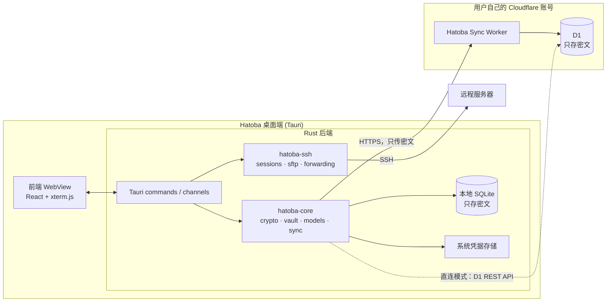

# Hatoba 架构与需求文档

## 0. 范围与约定

本文件定义 Hatoba 的功能范围、架构、数据格式、同步协议和安全模型，是实现的行为依据。各需求的实现进度见[实现状态](status.md)。

视觉与交互以 Claude Design 设计稿为准，设计稿文件和移植约定见[设计稿说明](design/README.md)。当设计稿和本文件冲突时：视觉、布局、文案以设计稿为准；行为、数据、安全以本文件为准。设计稿中缺少本文件要求的元素（例如 Setup Token 输入框、同步冲突状态、设置页）时，按设计稿的视觉风格补齐。

**首发平台是 Windows。** 设计稿是 macOS 外观，Windows 版按 §9.1 做平台适配（标题栏、字体、快捷键等），整体风格保持一致。macOS 版本（P1）沿用设计稿原样。

优先级定义：**P0** 为 MVP 必须；**P1** 为首个公开版本；**P2** 为之后版本。

---

## 1. 产品概述

Hatoba（波止場，码头）是一款开源桌面 SSH 客户端，定位接近 Termius：集中管理主机、密钥和终端会话。和同类产品的区别在于：

1. **同步后端由用户自己的 Cloudflare 账号提供**（Worker + D1），不依赖任何 Hatoba 官方服务器。
2. **端到端加密**：所有数据在客户端加密后才离开本机。Worker、D1 乃至整个 Cloudflare 账号泄露，都不会暴露明文。
3. **苹果式极简界面**，同时面向每天高强度使用的开发者，信息密度中等偏高。

### 1.1 目标用户

个人开发者、独立开发者、管理多台 VPS 的运维人员。

---

## 2. 技术栈

| 层 | 选型 | 说明 |
|---|---|---|
| 桌面壳 | Tauri 2 | **Windows 优先**（WebView2），之后是 macOS / Linux |
| 前端 | React + TypeScript + Vite | 状态管理用 Zustand |
| 终端渲染 | `@xterm/xterm` | 插件：`addon-fit`、`addon-webgl`、`addon-search`、`addon-web-links` |
| IPC 类型 | tauri-specta | 从 Rust 生成 TypeScript 绑定，避免手写类型 |
| 后端运行时 | Rust stable + tokio | |
| SSH | `russh` | 连接、认证、PTY、direct-tcpip（跳板机与端口转发） |
| SFTP | `russh-sftp` | |
| 密钥解析与生成 | russh 的 `keys` 模块（`ssh-key`） | 支持 OpenSSH / PEM 格式和带口令的私钥；PuTTY `.ppk` 由 `crates/hatoba-ssh/src/ppk.rs` 解析 |
| 加密 | `argon2`、`hkdf`、`sha2`、`aes-gcm`、`rand`、`zeroize` | 全部在 Rust 端完成 |
| 本地存储 | `rusqlite`（bundled） | |
| 系统凭据存储 | `keyring`（Windows 凭据管理器 / macOS 钥匙串） | Windows Hello 用 `windows` crate；之后 macOS Touch ID 用 `security-framework` |
| Windows 窗口效果 | `window-vibrancy` | Windows 11 上实现 Mica 背景材质 |
| HTTP | `reqwest`（rustls） | |
| 日志 | `tracing` | |
| 同步服务 | Cloudflare Workers（TypeScript）+ D1 | 路由用 Hono，部署用 wrangler |

---

## 3. 架构

### 3.1 总览



### 3.2 核心原则

1. **秘密只存在于 Rust 进程内。** WebView 永远拿不到 vault key、私钥或主机密码的明文。前端只接收展示所需的元数据（主机名、地址、标签、指纹、`has_password` 这类布尔值）。用户在表单里输入的密码只单向发给 Rust，之后不再回传给前端。
2. **本地优先。** 所有读写先落本地 SQLite，同步在后台进行。没有网络、没有配置同步时，功能完整可用。
3. **本地与云端使用同一种密文格式。** 本地库同样只存密文，解锁后在内存中解密。
4. **`hatoba-core` 不依赖 Tauri**，为后续移动端复用做准备。

### 3.3 仓库结构

```
hatoba/
├── apps/desktop/
│   ├── src/                  # 前端
│   │   ├── app/              # 布局、路由
│   │   ├── features/         # onboarding, unlock, hosts, terminal, sftp, keys, sync, settings
│   │   ├── components/       # 从设计稿移植的通用组件
│   │   ├── styles/           # 设计 token（CSS 变量，浅色 / 深色两套）
│   │   ├── i18n/             # 文案资源
│   │   └── ipc/              # tauri-specta 生成的绑定、前端契约、浏览器模拟后端
│   ├── src-tauri/            # Tauri 壳：commands、channels、capabilities
│   └── e2e/                  # WebDriver 端到端冒烟测试
├── crates/
│   ├── hatoba-core/          # crypto、vault、数据模型、本地存储、同步引擎
│   └── hatoba-ssh/           # SSH 会话、PTY、SFTP、端口转发、known_hosts
├── workers/sync/             # Cloudflare Worker 源码 + D1 migrations + 部署说明
└── docs/
```

### 3.4 移动端预留

移动端暂不实现。之后可以用 Tauri 2 mobile，或用 Flutter 通过 flutter_rust_bridge 调用 `hatoba-core`。因此 `hatoba-core` 中不得引入桌面专属依赖，平台相关能力（钥匙串、生物识别）通过 trait 注入。

---

## 4. 安全模型与加密设计

### 4.1 密钥层级

```
主密码
 └─ Argon2id(kdf_salt, m=64 MiB, t=3, p=4) → master_key (32B)
     ├─ HKDF-SHA256(info="hatoba/enc/v1")  → enc_key  (32B)  只在客户端使用
     └─ HKDF-SHA256(info="hatoba/auth/v1") → auth_key (32B)  发给 Worker 用于登录

vault_key (32B 随机生成)
 ├─ AES-256-GCM(enc_key)      → protected_vault_key   存本地和云端
 └─ AES-256-GCM(recovery_key) → recovery_vault_key    存本地和云端

recovery_code（128 bit 随机，只给用户看一次）
 ├─ HKDF-SHA256(info="hatoba/recovery/v1")      → recovery_key
 └─ HKDF-SHA256(info="hatoba/recovery-auth/v1") → recovery_auth

每条数据 → AES-256-GCM(vault_key)
```

- KDF 参数以 JSON 形式存在 `kdf_params` 中（含算法名和版本），以后调整参数时不会被老数据卡住。
- 客户端对 KDF 参数设有下限，低于下限的参数（无论来自 Worker 还是本地数据库）一律拒绝。下限由 `crates/hatoba-core/src/crypto.rs` 的 `KdfFloor::PRODUCTION` 定义。
- 恢复码附加 32 bit 校验后显示为 8 组 × 4 位 Crockford Base32，便于抄写和校验输入，格式由 `crates/hatoba-core/src/recovery.rs` 实现。
- 修改主密码只需重新生成 salt、重新加密 `protected_vault_key`，**不需要重新加密任何数据条目**。
- 服务端只保存 `SHA-256(auth_key)` 和 `SHA-256(recovery_auth)`。两者都是高熵值，SHA-256 足够；想通过它们反推主密码，仍然要逐个尝试 Argon2id。

### 4.2 数据加密格式（信封）

```json
{ "v": 1, "n": "<base64，12 字节随机 nonce>", "c": "<base64，密文 + GCM tag>" }
```

- 每次加密都生成新的随机 nonce。
- AAD 为 UTF-8 字符串 `hatoba/item/v1/{item_id}`，防止密文被挪到其他条目上还能解密成功。
- 明文是条目的 JSON（见 §5.1），其中包含 `type` 字段。**条目类型不以明文形式出现在任何存储中。**

### 4.3 运行时安全

| 编号 | 要求 | 优先级 |
|---|---|---|
| SEC-01 | 解锁后 vault_key 和解密后的条目只保存在 Rust 内存中，锁定时用 zeroize 清除 | P0 |
| SEC-02 | 自动锁定：闲置超时（默认 15 分钟，可配置）、系统睡眠、手动锁定（Ctrl+Shift+L） | P0 |
| SEC-03 | 锁定时已建立的 SSH 会话默认保持连接，但界面被遮罩；设置中可改为锁定即断开 | P0 |
| SEC-04 | 日志中不得出现密码、私钥、vault key、会话 token 或终端内容 | P0 |
| SEC-05 | Tauri 加固：CSP `default-src 'self'`，不加载任何远程内容，capabilities 按最小权限配置，release 版禁用 devtools，不启用 shell 插件 | P0 |
| SEC-06 | 本地连续解锁失败时递增延迟：前 3 次不延迟，之后逐次翻倍，最长 5 分钟（`crates/hatoba-core/src/vault.rs` 的 `unlock_delay_ms`）；失败次数持久化，重启应用不清零；延迟期间不运行 Argon2id | P0 |
| SEC-07 | Windows Hello 解锁：用 `KeyCredentialManager` 创建 Hello 凭据，对固定挑战值签名，由签名经 HKDF 派生包装密钥来加密 vault_key，密文存入凭据管理器。只调用 `UserConsentVerifier` 弹出确认框不满足要求，因为它与 vault_key 没有密码学绑定 | P1 |
| SEC-08 | 复制密码到剪贴板后 30 秒自动清空 | P1 |
| SEC-09 | 设置主密码时提示强度（zxcvbn） | P1 |
| SEC-10 | Touch ID 解锁（随 macOS 版本）：vault_key 存入 macOS 钥匙串，并加生物识别访问控制 | P2 |

### 4.4 威胁模型

| 场景 | 结果 |
|---|---|
| Cloudflare 账号、Worker 或 D1 被盗、被导出 | 攻击者只能拿到密文和 KDF 参数，必须对主密码做 Argon2id 暴力破解 |
| 网络中间人 | 传输走 HTTPS；即使被解开，内容也只是密文 |
| Worker 代码被恶意修改 | 无法解密数据，但可以删除数据、回滚到旧版本、拒绝服务。本地副本不受影响；回滚检测列为 P2 |
| 恶意 Worker 在登录时读取 `auth_key` | `enc_key` 与 `vault_key` 无法从 `auth_key` 推出（§4.1 的单向派生） |
| 恶意 Worker 在 `/v1/prelogin` 返回被削弱的 KDF 参数 | 客户端按 §4.1 的下限拒绝登录 |
| 持有有效的完整会话 token | 可以修改主密码（`PUT /v1/vault/password` 不要求旧密码）。设备丢失后应从另一台设备吊销它，并考虑修改主密码 |
| 持有恢复码 | 等于持有整个保险库：既能解出 `vault_key`，也能通过 `/v1/recover` 重设主密码 |
| 本机在解锁状态下被控制 | 不在防护范围内 |
| 忘记主密码且丢失恢复码 | 数据无法恢复。这是设计使然，需在 UI 中明确告知 |

### 4.5 服务端可见的数据

服务端保存的列由 §5.3 的迁移定义，其中条目和设备名都是 §4.2 的信封。

**服务端看不到**：主密码、`master_key`、`enc_key`、`vault_key`、恢复码、任何条目明文，以及条目的类型（类型在加密后的明文里）。

**服务端能看到的元数据**：条目数量、ID、密文大小、修改时间、设备数量、登录和同步的时间，以及 Cloudflare 本来就能看到的 IP 地址。

---

## 5. 数据模型

### 5.1 条目类型（加密前的明文结构）

所有条目 ID 使用 UUIDv7。读取明文时容忍未知字段和缺失字段，使不同版本的应用能读取彼此的数据。Rust 端的实现是 `crates/hatoba-core/src/model.rs` 的 `Item`。

```ts
type Item = Host | Group | SshKey | KnownHost | PortForward | Snippet | Settings;

interface Host {
  type: "host";
  name: string;                 // 显示名，如 prod-api-tokyo
  address: string;              // 域名或 IP
  port: number;                 // 默认 22
  username: string;
  auth:
    | { kind: "password"; password: string }
    | { kind: "key"; key_id: string }
    | { kind: "agent" }         // P1
    | { kind: "ask" };          // 每次连接时询问
  group_id: string | null;
  tags: string[];               // 如 ["production", "tokyo"]
  favorite: boolean;
  jump_host_id: string | null;  // P1，ProxyJump
  note: string;
  updated_at: number;           // 毫秒时间戳，用于冲突解决
}

interface Group {
  type: "group";
  name: string;
  parent_id: string | null;     // MVP 只支持一层嵌套
  sort: number;
  updated_at: number;
}

interface SshKey {
  type: "key";
  name: string;
  algorithm: "ed25519" | "ecdsa" | "rsa";
  private_key: string;          // OpenSSH 格式
  passphrase: string | null;    // 私钥口令（如有）
  public_key: string;
  fingerprint: string;          // SHA256:...
  comment: string;
  created_at: number;
  updated_at: number;
}

interface KnownHost {
  type: "known_host";
  host: string;
  port: number;
  key_type: string;
  public_key: string;
  fingerprint: string;
  first_seen_at: number;
  updated_at: number;
}

interface PortForward {          // P1
  type: "forward";
  host_id: string;
  kind: "local" | "remote" | "dynamic";
  bind_address: string;
  bind_port: number;
  dest_host: string | null;     // dynamic 时为 null
  dest_port: number | null;
  auto_start: boolean;
  updated_at: number;
}

interface Snippet {              // P2
  type: "snippet";
  name: string;
  command: string;
  tags: string[];
  updated_at: number;
}

interface Settings {             // 固定 ID "settings"，只有一条
  type: "settings";
  terminal: {
    font_family: string;
    font_size: number;
    theme: "system" | "light" | "dark";
    cursor_style: "block" | "bar" | "underline";
    scrollback: number;         // 默认 10000
  };
  auto_lock_minutes: number;
  lock_disconnects_sessions: boolean;
  updated_at: number;
}
```

"最近连接时间"、窗口尺寸这类设备本地数据**不进入同步**，否则每次连接都会产生一次写入和潜在冲突。

### 5.2 本地 SQLite

表结构由 `crates/hatoba-core/src/store.rs` 的 `MIGRATIONS` 定义，`meta` 表的键由同文件的 `meta` 模块列出。表的职责如下：

- `meta`：键值对，保存 KDF 参数、被包装的 vault key、设备 ID、同步游标等。
- `items`：每个条目一行，`envelope` 只保存 §4.2 的信封，删除后为 NULL（墓碑）。`revision` 是服务器确认过的版本，从未同步的条目为 0；`dirty` 标记尚未推送的本地修改。
- `local_state`：不同步的设备本地数据，例如最近连接时间。
- `conflict_log`：§6.4 自动解决的冲突，供逐条查看和恢复。

同步会话 token 和 D1 直连模式的 Cloudflare API token 存在系统凭据存储里（Windows 凭据管理器），不写入 SQLite，也不进入同步。

### 5.3 D1 表结构

一个 Worker 部署只服务一个用户（单保险库）。表结构由 `workers/sync/migrations/` 中的迁移按文件名编号顺序定义（`0001_init.sql` 起），Worker 和 D1 直连模式共用：

- `meta`：只有一行（`id = 1`），保存 KDF 参数、`SHA-256(auth_key)`、`SHA-256(recovery_auth)`、两个被包装的 vault key 和全局 `seq`。
- `items`：条目信封、`revision`、`seq`、删除标记和更新时间。`seq` 全局递增，用于增量拉取。
- `sessions`：只在 Worker 模式使用，保存 `SHA-256(session_token)`、设备 ID、用 vault_key 加密的设备名和会话的 `scope`（完整会话或恢复会话）。

---

## 6. 同步

### 6.1 两种同步后端

客户端通过 `SyncBackend` trait 抽象同步后端，同步引擎不关心底层是哪种实现。

```rust
#[async_trait]
pub trait SyncBackend {
    async fn health(&self) -> Result<ServerInfo>;
    async fn prelogin(&self) -> Result<KdfInfo>;
    async fn setup(&self, init: VaultInit) -> Result<()>;
    async fn login(&self, auth_key: &[u8], device: DeviceInfo) -> Result<Session>;
    async fn fetch_vault(&self) -> Result<VaultMeta>;
    async fn pull(&self, since_seq: u64, limit: u32) -> Result<PullPage>;
    async fn push(&self, changes: Vec<Change>) -> Result<Vec<PushResult>>;
    async fn update_vault_meta(&self, update: VaultMetaUpdate) -> Result<()>;
}
```

**Worker 模式（P0，推荐）**：用户把 `workers/sync` 部署到自己的 Cloudflare 账号，客户端通过 HTTPS 调用 §6.2 的 API。

**D1 直连模式（P1）**：用户填写 Account ID 和 API Token，再从账号下的 D1 数据库中选择一个，客户端直接调用 `POST https://api.cloudflare.com/client/v4/accounts/{account_id}/d1/database/{database_id}/query` 执行 SQL。表结构与 Worker 模式相同（不使用 `sessions` 表），并发冲突靠 `UPDATE ... WHERE revision = ?` 后检查受影响行数判断。该模式下 API Token 通常对整个账号的 D1 都有编辑权限，界面上要说明这个风险，token 只存本机凭据存储。

### 6.2 Worker API

所有接口都在 `/v1` 下，请求和响应都是 JSON（`Content-Type: application/json`，其他类型返回 `415`）。需要会话的接口使用 `Authorization: Bearer <session_token>`。

#### 约定

- 时间戳一律是 Unix 毫秒（与条目明文里的 `updated_at` 一致），包括 `created_at`、`last_seen`、`expires_at`。
- `auth_key`、`recovery_auth`：32 字节，**标准 base64（带 `=` 填充）**，由客户端发送原始值，服务端存 `SHA-256`（十六进制）。
- `kdf_params`：**JSON 字符串**（客户端把参数对象序列化成字符串发送），服务端原样存储、原样返回，不解释其内容。必须是 JSON 对象，最大 1 KB。
- `kdf_salt`：16–256 个字符的不透明字符串（`A-Za-z0-9+/_=-`），服务端不解码。
- `protected_vault_key`、`recovery_vault_key`、`device_name`、条目 `envelope`：不透明字符串，原样存储。分别最大 4 KB、4 KB、4 KB、64 KB（按 UTF-8 字节计）。
- `device_id`、条目 `id`：`[A-Za-z0-9_-]`，1–64 个字符（UUID 和字面量 `settings` 都符合）。
- 错误响应：`{ "error": "<code>", "message": "..." }`，`message` 可能省略，且永远不会回显提交的值。

#### 接口

| 方法 | 路径 | 认证 | 说明 |
|---|---|---|---|
| GET | `/v1/health` | 无 | `{ service: "hatoba-sync", version, api: 1, initialized }`，用于向导中的"测试连接"；D1 不可用或未迁移时 `503 database_unavailable` |
| GET | `/v1/prelogin` | 无 | `{ kdf_salt, kdf_params }`；未初始化 `404 not_initialized` |
| POST | `/v1/setup` | Setup Token | 首次初始化 meta；成功 `201 { initialized: true }`，已初始化 `409 already_initialized`，令牌错误 `401 invalid_setup_token`，未配置 `503 setup_token_not_configured` |
| POST | `/v1/login` | 无 | `{ auth_key, device_id, device_name }` → `{ session_token, expires_at }` |
| POST | `/v1/recover` | 无 | `{ recovery_auth, device_id, device_name }` → `{ recovery_vault_key, kdf_salt, kdf_params, session_token, expires_at }`（恢复会话） |
| GET | `/v1/vault` | 完整会话 | `{ schema_version, kdf_salt, kdf_params, protected_vault_key, recovery_vault_key, seq }` |
| GET | `/v1/items?since=&limit=` | 完整会话 | 增量拉取：`{ items, next_since, has_more }` |
| POST | `/v1/items` | 完整会话 | 批量推送：`{ changes: [...] }` → `{ results: [...] }` |
| PUT | `/v1/vault/password` | 完整或恢复会话 | 修改主密码：原子更新 meta 并吊销会话，成功 `200 { ok, relogin_required }` |
| GET | `/v1/devices` | 完整会话 | `{ devices: [{ device_id, device_name, created_at, last_seen, expires_at, current }] }` |
| DELETE | `/v1/devices/:device_id` | 完整会话 | 吊销该设备的会话，`204`；可以吊销自己；设备不存在时同样返回 `204` |

#### 服务端要求

- **Setup Token**：部署时用 `wrangler secret put SETUP_TOKEN` 设置，防止别人抢先初始化一个刚部署、还没配置的 Worker。没有它，`/v1/setup` 一律拒绝（`401`）；没有配置该 secret 时返回 `503`。初始化完成后可以删除该 secret。比较使用常量时间，`auth_hash` 的比较同理。
- **会话**：token 为 32 字节随机值（base64url），D1 中只存其 SHA-256；有效期 30 天，使用时滑动续期（续期写入每分钟最多一次）。每台设备（`device_id`）同一种会话只保留一个。
- **恢复会话**：`/v1/recover` 签发的会话 15 分钟有效，只能调用 `PUT /v1/vault/password`，调用其他接口返回 `403`。
- **限流**：`/v1/setup`、`/v1/login`、`/v1/recover` 按来源 IP 和接口分别限制为每分钟 10 次，使用 Workers Rate Limiting binding，超出返回 `429`。计数按 Cloudflare 数据中心独立统计。
- **大小限制**：单次推送最多 100 条变更，单个信封最大 64 KB。
- **不返回 CORS 头**：客户端请求都来自 Rust 而不是浏览器，浏览器里的第三方网页因此无法跨域调用 Worker。
- **不记录秘密**：不把 token、`auth_key`、信封或请求体写入日志；所有响应带 `Cache-Control: no-store`。

#### POST /v1/setup

```http
POST /v1/setup
Authorization: Bearer <SETUP_TOKEN>
Content-Type: application/json

{
  "schema_version": 1,
  "kdf_salt": "<opaque salt>",
  "kdf_params": "{\"alg\":\"argon2id\",\"v\":1,...}",
  "auth_key": "<base64, 32 bytes>",
  "protected_vault_key": "<envelope>",
  "recovery_vault_key": "<envelope>",
  "recovery_auth": "<base64, 32 bytes>"
}
```

#### GET /v1/items

按 `seq` 增量拉取：`SELECT * FROM items WHERE seq > :since ORDER BY seq LIMIT :limit`。`since` 默认 0；`limit` 默认 500，最大 1000（更大的值会被截为 1000）；非法值返回 `400`。

```json
{
  "items": [
    { "id": "0192...", "envelope": "{\"v\":1,...}", "revision": 4, "seq": 1207, "deleted": false, "updated_at": 1790000000000 }
  ],
  "next_since": 1207,
  "has_more": false
}
```

`next_since` 是本页最后一条的 `seq`（空页时等于传入的 `since`）。已删除条目是墓碑：`deleted: true, envelope: null`。

#### POST /v1/items

```json
{ "changes": [
  { "id": "0192...", "base_revision": 3, "deleted": false, "envelope": "{\"v\":1,...}", "updated_at": 1790000000000 }
]}
```

- `base_revision = 0` 表示新建；否则必须等于服务端该条目的 revision（乐观并发）。
- 删除：`deleted: true` 且 `envelope` 为 `null`（或省略）。非删除项的 `envelope` 必须是非空字符串。
- `updated_at` 可选；省略时使用服务器时间。
- 每次请求最多 100 条变更，超出返回 `413 too_many_changes`。同一请求里不能重复出现同一个 `id`。

服务端对每条变更执行一个 D1 batch（batch 在 D1 中以事务方式执行）：

1. `UPDATE meta SET seq = seq + 1 WHERE id = 1`
2. 如果 `base_revision = 0`，执行 `INSERT ... ON CONFLICT(id) DO NOTHING`，新条目的 `revision = 1`；否则执行 `UPDATE items SET envelope = ?, deleted = ?, revision = revision + 1, seq = (SELECT seq FROM meta WHERE id = 1), updated_at = ? WHERE id = ? AND revision = ?`
3. 受影响行数为 0 即为冲突，读取该条目的行返回给客户端。

`results` 与请求顺序一致：

```json
{ "results": [
  { "id": "0192...", "status": "ok", "revision": 4, "seq": 1207 },
  { "id": "0193...", "status": "conflict",
    "server": { "revision": 6, "seq": 1190, "deleted": false, "envelope": "...", "updated_at": 1790000000000 } },
  { "id": "0194...", "status": "error", "error": "too_large" },
  { "id": "0195...", "status": "error", "error": "not_found" }
]}
```

| status | 含义 |
|---|---|
| `ok` | 已写入，返回新的 `revision` 和 `seq` |
| `conflict` | `base_revision` 与服务端不一致（含"新建但 ID 已存在"）。`server` 是服务端上该条目的状态（墓碑的 `envelope` 为 `null`），由客户端按 §6.4 解决后重试 |
| `error` / `too_large` | 单个信封超过 64 KB。**只影响这一条**，其余变更照常处理，一个超大条目不会卡住整个推送队列 |
| `error` / `not_found` | `base_revision > 0` 但服务端没有这个条目（例如数据库被重置）。客户端可把该条目当作新条目（`base_revision = 0`）重新上传 |

`seq` 全局单调递增但允许出现空洞（冲突的尝试也会消耗一个 seq），客户端只依赖它的单调递增性。

结构性错误（缺字段、类型错误、非法 ID、`deleted` 与 `envelope` 不一致、重复 ID）会让**整个请求**返回 `400`，且不写入任何数据。

#### PUT /v1/vault/password

```json
{
  "kdf_salt": "...", "kdf_params": "{...}",
  "auth_key": "<base64, 32 bytes>",
  "protected_vault_key": "<envelope>",
  "recovery_vault_key": "<envelope>", "recovery_auth": "<base64, 32 bytes>"
}
```

`recovery_vault_key` 和 `recovery_auth` 要么同时提供（轮换恢复码），要么都不提供。更新 `meta` 与吊销会话在同一个事务里完成：

- 完整会话：吊销**其他所有**会话，调用者保持登录（`relogin_required: false`）。
- 恢复会话：吊销**所有**会话包括调用者自己（`relogin_required: true`），客户端需要用新密码重新登录。

#### 错误码

| HTTP | `error` | 场景 |
|---|---|---|
| 400 | `invalid_request` / `invalid_json` | 字段缺失、类型或格式错误；JSON 无法解析 |
| 401 | `unauthorized` / `invalid_session` | 缺少 token / token 未知或已过期 |
| 401 | `invalid_credentials` | `auth_key` 或 `recovery_auth` 错误 |
| 401 | `invalid_setup_token` | Setup Token 缺失或错误 |
| 403 | `insufficient_scope` | 恢复会话调用了 `PUT /v1/vault/password` 以外的接口 |
| 404 | `not_initialized` / `not_found` | 尚未 setup / 路径不存在 |
| 409 | `already_initialized` | 重复 setup |
| 413 | `too_many_changes` / `payload_too_large` | 超过 100 条变更 / 请求体过大 |
| 415 | `unsupported_media_type` | 请求体不是 JSON |
| 429 | `rate_limited` | 触发限流（带 `Retry-After: 60`） |
| 500 | `internal_error` | 未预期的错误（细节不会返回给客户端） |
| 503 | `setup_token_not_configured` / `database_unavailable` | 未设置 secret / D1 不可用或未迁移 |

### 6.3 客户端同步流程

**触发时机**：解锁后、本地修改后（2 秒防抖）、每 60 秒、窗口重新获得焦点时，以及用户手动触发。

**单轮同步**：

1. 从 `sync_cursor` 开始分页拉取，直到 `has_more = false`。对每条远端条目：如果本地对应条目不是 dirty，直接覆盖；如果是 dirty，按 §6.4 解决冲突。
2. 推送所有 dirty 条目。成功的条目清除 dirty 并更新 revision；冲突的条目按 §6.4 处理后最多重试一次。
3. 更新 `sync_cursor`，并向前端广播同步状态。

同步失败不影响本地使用，界面显示为"离线"或"认证失效"，下次触发时自动重试，重试采用指数退避。

### 6.4 冲突解决

1. 默认规则：解密双方版本，按明文中的 `updated_at` 取较新者（last writer wins）。
2. **密钥条目（`type = "key"`）永不静默丢弃**：落败的一方另存为新条目，名称后加"（冲突副本）"。
3. 一方删除、另一方修改时，修改方胜出（条目恢复），避免误删。
4. 每次自动解决冲突都写入本地冲突日志，同步状态页显示冲突数量，P1 版本支持逐条查看：可保留自动解决的结果，或恢复另一方的版本。

### 6.5 墓碑

删除的条目在 MVP 中永久保留墓碑（`envelope = NULL, deleted = 1`），数据量很小。P2 再考虑清理超过 180 天的墓碑，届时离线超过该时长的设备需要做全量重新同步。

### 6.6 关键流程

**流程 A：首台设备启用同步**

1. 首次启动时创建本地保险库：设置主密码，生成恢复码，用户确认已保存。此后可以完全离线使用。
2. 在侧边栏进入"云同步"，选择 Worker 模式，填写 Worker URL 和 Setup Token，点击"测试连接"（调用 `/v1/health`）。
3. 调用 `/v1/setup` 上传 meta，然后登录并推送全部条目。

**流程 B：新设备加入**

1. 首次启动时选择"从云端恢复"，填写 Worker URL。
2. 调用 `/v1/prelogin` 拿到 salt 和参数，用户输入主密码后派生密钥并登录。
3. 拉取 vault meta，解密 vault_key，然后全量拉取所有条目。

**流程 C：已有本地保险库，连接到已初始化的云端（P1）**

两边的 vault_key 不同，需要合并：用本地 vault_key 解密本地全部条目，用云端 vault_key 重新加密后作为新条目推送，然后把本地 meta 替换为云端的版本，主密码也随之变为云端的主密码。执行前必须让用户明确确认。MVP 阶段遇到这种情况时直接提示用户"云端已有保险库，请在新设备上选择'从云端恢复'"。

**Worker 部署**：步骤见[部署同步 Worker](../workers/sync/README.md)，应用内的同步向导链接到这份说明。另提供 Deploy to Cloudflare 按钮（P1）；通过 Cloudflare API 在应用内一键部署列为 P2。

---

## 7. SSH 功能需求

### 7.1 连接与认证

| 编号 | 需求 | 优先级 |
|---|---|---|
| SSH-01 | 密码认证 | P0 |
| SSH-02 | 私钥认证，支持 ed25519、ecdsa、rsa，以及带口令的私钥 | P0 |
| SSH-03 | "每次询问"模式：连接时弹窗输入密码，不保存 | P0 |
| SSH-04 | 主机指纹校验：首次连接时弹出指纹确认（TOFU），确认后保存为 `known_host` 条目并参与同步；指纹变化时**阻断连接**并显示明显警告，用户必须显式选择"更新指纹"才能继续 | P0 |
| SSH-05 | 连接超时（默认 15 秒），并针对 DNS 解析失败、连接被拒、认证失败、超时分别给出可读的错误信息 | P0 |
| SSH-06 | Keepalive（默认 30 秒）与断线检测 | P0 |
| SSH-07 | 断线后在标签页内显示"重新连接"按钮，不自动无限重连 | P0 |
| SSH-08 | keyboard-interactive 认证（含 2FA / OTP） | P1 |
| SSH-09 | ssh-agent：Windows 使用 OpenSSH agent 命名管道 `\\.\pipe\openssh-ssh-agent`；macOS / Linux 使用 `SSH_AUTH_SOCK`；兼容 Pageant 为 P2 | P1 |
| SSH-10 | ProxyJump 跳板机，支持多级：在上一跳连接上打开 direct-tcpip 通道，再在通道上建立下一跳会话 | P1 |
| SSH-11 | 导入 `%USERPROFILE%\.ssh\config`（macOS / Linux 为 `~/.ssh/config`），支持 Host、HostName、User、Port、IdentityFile、ProxyJump | P1 |
| SSH-12 | 导入 PuTTY 已保存的会话（读取注册表 `HKCU\Software\SimonTatham\PuTTY\Sessions`） | P2 |

### 7.2 终端

| 编号 | 需求 | 优先级 |
|---|---|---|
| TERM-01 | 多标签页，每个标签对应一个会话，同一主机可以同时打开多个 | P0 |
| TERM-02 | `xterm-256color` 与 truecolor，UTF-8；**中文、日文宽字符显示必须正常，微软拼音、微软日文输入法等 Windows 输入法的候选框位置和上屏必须正常** | P0 |
| TERM-03 | 窗口或面板尺寸变化时同步 PTY 尺寸 | P0 |
| TERM-04 | 复制粘贴；粘贴多行内容时弹出确认 | P0 |
| TERM-05 | 回滚缓冲默认 10,000 行，可配置 | P0 |
| TERM-06 | 字体、字号、主题（浅色 / 深色 / 跟随系统） | P0 |
| TERM-07 | 终端内搜索 | P1 |
| TERM-08 | 链接可点击 | P1 |
| TERM-09 | 分屏 | P2 |
| TERM-10 | 会话日志保存到本地文件 | P2 |
| TERM-11 | Snippets（常用命令片段） | P2 |

### 7.3 SFTP

| 编号 | 需求 | 优先级 |
|---|---|---|
| SFTP-01 | 终端右侧可展开文件面板，浏览远程目录，默认进入用户 home 目录 | P0 |
| SFTP-02 | 上传（支持拖拽）与下载，显示进度，可取消 | P0 |
| SFTP-03 | 重命名、删除（需确认）、新建目录 | P1 |
| SFTP-04 | 显示权限、大小、修改时间 | P1 |
| SFTP-05 | 直接编辑远程文件 | P2 |

### 7.4 端口转发

| 编号 | 需求 | 优先级 |
|---|---|---|
| FWD-01 | 本地转发（`-L`） | P1 |
| FWD-02 | 转发规则随连接自动启动 | P1 |
| FWD-03 | 远程转发（`-R`） | P2 |
| FWD-04 | 动态 SOCKS 转发（`-D`） | P2 |

---

## 8. 保险库、主机与密钥管理需求

### 8.1 保险库

| 编号 | 需求 | 优先级 |
|---|---|---|
| VAULT-01 | 首次启动时创建主密码 | P0 |
| VAULT-02 | 生成恢复码，要求用户确认已保存（例如重新输入恢复码的最后一组）后才能继续 | P0 |
| VAULT-03 | 解锁界面；连续输错时递增延迟 | P0 |
| VAULT-04 | 自动锁定（见 SEC-02） | P0 |
| VAULT-05 | 修改主密码 | P1 |
| VAULT-06 | 用恢复码重置主密码 | P1 |
| VAULT-07 | 导出加密备份：单个文件，内容使用同一种信封格式 | P1 |
| VAULT-08 | 明文导出（需重新验证主密码，并显示警告） | P2 |

### 8.2 主机

| 编号 | 需求 | 优先级 |
|---|---|---|
| HOST-01 | 新建、编辑、删除主机。必填项为名称和地址，端口默认 22 | P0 |
| HOST-02 | 分组（MVP 支持一层嵌套） | P0 |
| HOST-03 | 标签，侧边栏支持按标签筛选 | P0 |
| HOST-04 | 收藏 | P0 |
| HOST-05 | 搜索：模糊匹配名称、地址、用户名和标签；快捷键见 WIN-04 | P0 |
| HOST-06 | 显示最近连接时间（设备本地数据） | P0 |
| HOST-07 | 双击或按回车直接连接 | P0 |
| HOST-08 | 主机编辑页中，已保存的密码只显示"已保存"，只能替换，不能查看 | P0 |
| HOST-09 | 复制主机 | P1 |
| HOST-10 | 在线状态点：对列表中可见的主机做 TCP 端口探测（只建立 TCP 连接，不做认证），超时 3 秒，每 60 秒一次；可在设置中关闭 | P1 |

### 8.3 密钥

| 编号 | 需求 | 优先级 |
|---|---|---|
| KEY-01 | 导入私钥（选择文件或粘贴文本），解析失败时给出明确原因（格式不支持、口令错误等） | P0 |
| KEY-02 | 生成 ed25519 密钥，可选 RSA 4096 | P0 |
| KEY-03 | 列表显示名称、类型、SHA256 指纹、创建时间和使用该密钥的主机 | P0 |
| KEY-04 | 一键复制公钥 | P0 |
| KEY-05 | 删除前提示哪些主机在使用该密钥 | P0 |
| KEY-06 | 把公钥部署到指定主机（相当于 `ssh-copy-id`） | P1 |
| KEY-07 | 查看私钥内容（需重新验证主密码） | P2 |

---

## 9. 界面需求

视觉以设计稿为准，本节只规定每个页面必须具备的行为和状态。

| 页面 | 关键行为 | 必须覆盖的状态 |
|---|---|---|
| 解锁 | 输入主密码；Windows Hello（P1）；"忘记主密码"进入恢复码流程 | 密码错误、节流等待中 |
| 首次启动 | 二选一："创建新保险库"或"从云端恢复" | — |
| 主机列表 | 侧边栏包含全部、收藏、分组、标签；列表行显示名称、`user@host:port`、标签、在线状态、最近连接时间；顶部有搜索框和新建按钮 | 空状态（引导新建主机或导入 ssh config）、搜索无结果 |
| 主机编辑 | 字段见 §5.1；密码字段规则见 HOST-08 | 字段校验错误 |
| 终端 | 顶部标签栏、连接状态、可展开的 SFTP 面板 | 连接中、连接失败（带重试按钮）、指纹确认对话框、指纹不匹配警告、已断开 |
| 密钥库 | 见 §8.3 | 空状态 |
| 云同步 | 三步向导：选择模式 → 填写连接信息（Worker URL + Setup Token，或 Account ID + API Token 并选择数据库）→ 设置或输入主密码；完成后显示状态页 | 已同步、同步中、有冲突、离线、认证失效；设备列表与吊销操作 |
| 设置 | 终端外观、自动锁定时长、锁定时是否断开会话、语言 | — |

**全局要求**：

- 快捷键见 §9.1 WIN-04。
- 主题默认跟随系统，浅色和深色两套 token 均从设计稿中提取。
- 国际化：**从第一天起所有文案都要外置，不允许硬编码**（P0）；简体中文、日文、英文三套翻译列为 P1，默认跟随系统语言。
- 设计稿中的 macOS 元素（红绿灯按钮、SF 字体、半透明侧边栏）在 Windows 上的替代方案见 §9.1。

### 9.1 Windows 适配

设计稿是 macOS 外观，Windows 首发版按下表适配。原则是保留设计稿的留白、层级、圆角和配色，只替换平台相关的部分。

| 编号 | 需求 | 优先级 |
|---|---|---|
| WIN-01 | 自绘标题栏（Tauri `decorations: false`）：标签栏与标题栏合一，右上角为 Windows 风格的最小化、最大化、关闭按钮；支持拖动、双击最大化，以及悬停最大化按钮时弹出 Windows 11 Snap Layouts（可参考 tauri-plugin-decorum 等方案）。设计稿左上角的红绿灯按钮在 Windows 上不显示 | P0 |
| WIN-02 | 字体映射：界面字体 SF Pro → `Segoe UI Variable`（Windows 10 回退 `Segoe UI`）；终端字体 SF Mono → `Cascadia Mono`（回退 `Consolas`）；中文回退 `Microsoft YaHei UI`，日文回退 `Yu Gothic UI` | P0 |
| WIN-03 | 高 DPI 与多显示器：100%、125%、150%、200% 缩放下显示清晰，窗口在不同缩放比例的显示器之间拖动时不模糊、不错位 | P0 |
| WIN-04 | 快捷键（见下表）。终端获得焦点时，Ctrl+字母必须原样发送给远端（Ctrl+L 清屏、Ctrl+W 删词、Ctrl+K 删到行尾等），因此应用级快捷键统一加 Shift | P0 |
| WIN-05 | 终端复制粘贴：有选中文本时 Ctrl+C 复制，否则发送 `^C`；Ctrl+V 和 Ctrl+Shift+V 都是粘贴；右键行为可设置为"有选中则复制，否则粘贴"（PuTTY 习惯）或弹出菜单 | P0 |
| WIN-06 | WebView2 运行时：安装包内置引导程序，Windows 10 上缺少运行时时自动安装 | P0 |
| WIN-07 | 背景材质：设计稿的半透明侧边栏在 Windows 11 上用 Mica 实现，Windows 10 回退为设计稿的纯色背景 | P1 |
| WIN-08 | 跟随系统浅色 / 深色模式，切换时实时更新 | P0 |
| WIN-09 | 私钥导入支持 PuTTY `.ppk` 格式（v2 / v3）。需确认所选密钥库是否支持，不支持则单独实现解析 | P1 |

| 操作 | Windows / Linux | macOS（P1） |
|---|---|---|
| 搜索主机 | Ctrl+Shift+K（焦点不在终端时 Ctrl+K 也可） | ⌘K |
| 新建标签 | Ctrl+Shift+T | ⌘T |
| 关闭标签 | Ctrl+Shift+W | ⌘W |
| 切换标签 | Ctrl+Tab / Ctrl+Shift+Tab | ⌃Tab / ⌃⇧Tab |
| 打开设置 | Ctrl+, | ⌘, |
| 锁定 | Ctrl+Shift+L | ⌘L |
| 复制 | Ctrl+Shift+C；有选中文本时 Ctrl+C | ⌘C |
| 粘贴 | Ctrl+Shift+V 或 Ctrl+V | ⌘V |

---

## 10. IPC 约定

### 10.1 Commands（前端调用 Rust）

命令的完整列表和签名由 tauri-specta 生成在 `apps/desktop/src/ipc/bindings.ts` 的 `commands` 对象中，Rust 实现按模块（vault、hosts、keys、ssh、forwards、sftp、sync、settings、app）放在 `apps/desktop/src-tauri/src/commands/` 下的同名文件里。

返回给前端的 DTO 一律不含秘密字段。例如 `HostView` 只有 `has_password: bool`，`KeyView` 只有公钥和指纹。

### 10.2 Events（Rust 推送给前端）

事件的完整列表由 tauri-specta 生成在 `apps/desktop/src/ipc/bindings.ts` 的 `events` 对象中，事件名由 `apps/desktop/src-tauri/src/dto.rs` 中各事件类型的 `#[tauri_specta(event_name = ...)]` 定义，按 `vault://`、`sync://`、`ssh://`、`transfer://` 前缀分组。

### 10.3 终端数据流

- **输出**：每个会话对应一个 Tauri `Channel`。Rust 端对 SSH 输出做缓冲，每 8 ms 或累积到 32 KB 时（以先到者为准）推送一次。事件类型为 `Data(bytes) | Closed { reason } | Error { message }`。
- 输出字节走 Tauri 2 Channel 的原始二进制传输路径（WebView 中为 `ArrayBuffer`），不序列化成 JSON 数组，否则吞吐量会很差。
- **输入**：`ssh_write` 把键盘输入发给 Rust。
- **背压（P1）**：前端处理不过来时，Rust 端缓冲上限设为 4 MB，超过后暂停从 SSH 通道读取数据。

---

## 11. 非功能需求

| 类别 | 要求 |
|---|---|
| 性能 | 冷启动到解锁界面 < 1 秒（主流 Windows 笔记本）；解锁（Argon2id）< 1.5 秒；持续大量输出（如 `cat` 一个 50 MB 文件）时界面不冻结；按键回显延迟 < 50 ms；1,000 台主机时搜索结果即时出现 |
| 可靠性 | 同步失败不影响本地使用；任何情况下都不能因为同步丢失私钥 |
| 平台 | Windows 10（21H2+）/ Windows 11 x64 为 P0；Windows arm64、macOS 13+、Linux（AppImage / deb）为 P1 |
| 分发 | Windows：NSIS 安装包（按用户安装，无需管理员权限）为 P0；Authenticode 代码签名为 P1（未签名会触发 SmartScreen 警告）；Tauri updater 签名更新为 P1。macOS 签名与公证随 macOS 版本 |
| 隐私 | 不收集任何遥测数据；本地日志按天滚动，保留 7 天 |
| 开源 | 公开仓库，MIT 许可证（[LICENSE](../LICENSE)） |

---

## 12. 测试

运行各项测试的命令见[开发指南](development.md#测试)。

- **单元测试**：加密模块使用固定测试向量；验证信封加解密往返；篡改 AAD 或密文时解密必须失败；冲突解决规则逐条覆盖。
- **SSH 集成测试**：测试启动一个临时的本机 OpenSSH `sshd`，覆盖密码、各类私钥、带口令私钥、PPK、指纹校验与指纹变化、keyboard-interactive、多级 ProxyJump、ssh-agent、SFTP、端口转发、50 MB 输出吞吐与背压、错误分类。`hatoba-ssh` 与平台无关，这部分测试在 CI 的 Linux runner 上运行。
- **Windows 测试**：CI 在 `windows-latest` 上构建并跑单元测试；发布前在 Windows 10 和 Windows 11 实机上手动验证安装、标题栏、输入法、高 DPI 和 Windows Hello。
- **Worker 测试**：使用 Vitest 配合 `@cloudflare/vitest-plugin`，在本地 workerd 和本地 D1 上测试所有 API，包括 Setup Token、会话与过期、并发冲突、分页、大小限制、改密吊销会话、恢复流程、设备管理和限流。
- **同步测试**：模拟两个客户端经模拟服务端并发修改同一条目，以及同步过程中网络中断；Worker 与 D1 直连两种后端的请求映射。
- **客户端与 Worker 联调**：`crates/hatoba-core/tests/worker_live.rs` 让两台设备通过 `wrangler dev` 运行的真实 Worker 同步（初始化、恢复、双向编辑、冲突、删除、设备列表、吊销），结束后扫描本地 D1，确认只有密文。
- **前端**：TypeScript 严格模式；tauri-specta 生成的绑定与 `apps/desktop/src/ipc/contract.check.ts` 中前端使用的契约在类型检查时双向比对；Vitest 单元测试；[端到端冒烟测试](../apps/desktop/e2e/README.md)用真实 Rust 后端和临时 `sshd` 走主流程。
- **安全检查**：对本地数据库文件、D1 导出文件和日志文件做明文扫描，确认其中不含测试数据里的主机名、密码和私钥。
