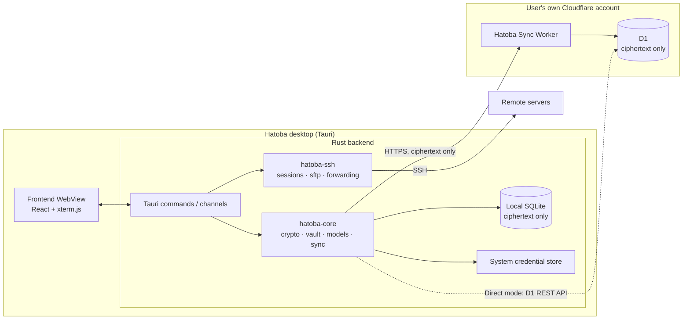

# Hatoba architecture and requirements

## 0. Scope and conventions

This document defines Hatoba's feature scope, architecture, data formats, sync protocol, and security model, and the implementation follows it. Progress on each requirement is tracked in [Implementation status](status.md).

Visuals and interaction follow the Claude Design files, which the [design notes](design/README.md) describe along with the porting conventions. When the design and this document disagree, the design wins on visuals, layout, and copy, and this document wins on behavior, data, and security. When the design lacks an element this document requires (for example the setup token field, the sync conflict states, or the settings pages), add it in the design's visual style.

**Windows is the first platform.** The design has a macOS look. The Windows version adapts it as described in §9.1 (title bar, fonts, shortcuts, and so on) and keeps the overall style. The macOS version (P1) follows the design as is.

Priorities: **P0** is required for the MVP, **P1** for the first public release, and **P2** for later releases.

---

## 1. Product overview

Hatoba is an open-source desktop SSH client, similar in scope to Termius: it keeps hosts, keys, and terminal sessions in one place. It differs from similar products in three ways:

1. **The sync backend runs in the user's own Cloudflare account** (Worker + D1), with no dependency on any official Hatoba server.
2. **End-to-end encryption.** All data is encrypted on the client before it leaves the device. A leak of the Worker, the D1 database, or even the whole Cloudflare account exposes no plaintext.
3. **A minimal, Apple-style interface** built for developers who use it heavily every day, with medium-to-high information density.

### 1.1 Target users

Individual developers, indie developers, and operators who manage several VPSs.

---

## 2. Tech stack

| Layer | Choice | Notes |
|---|---|---|
| Desktop shell | Tauri 2 | **Windows first** (WebView2), then macOS and Linux |
| Frontend | React + TypeScript + Vite | Zustand for state management |
| Terminal rendering | `@xterm/xterm` | Addons: `addon-fit`, `addon-webgl`, `addon-search`, `addon-web-links` |
| IPC types | tauri-specta | Generates TypeScript bindings from Rust instead of hand-written types |
| Backend runtime | Rust stable + tokio | |
| SSH | `russh` | Connections, authentication, PTY, direct-tcpip (jump hosts and port forwarding) |
| SFTP | `russh-sftp` | |
| Key parsing and generation | russh's `keys` module (`ssh-key`) | OpenSSH and PEM formats, including passphrase-protected keys. `crates/hatoba-ssh/src/ppk.rs` parses PuTTY `.ppk` |
| Cryptography | `argon2`, `hkdf`, `sha2`, `aes-gcm`, `rand`, `zeroize` | All in Rust |
| Local storage | `rusqlite` (bundled) | |
| System credential store | `keyring` (Windows Credential Manager, macOS Keychain) | Windows Hello uses the `windows` crate. Touch ID on macOS will use `security-framework` |
| Windows window effects | `window-vibrancy` | Mica backdrop on Windows 11 |
| HTTP | `reqwest` (rustls) | |
| Logging | `tracing` | |
| Sync service | Cloudflare Workers (TypeScript) + D1 | Hono for routing, wrangler for deployment |

---

## 3. Architecture

### 3.1 Overview



### 3.2 Core principles

1. **Secrets exist only inside the Rust process.** The WebView never receives the vault key, private keys, or host passwords in plaintext. The frontend receives only the metadata it displays (host names, addresses, tags, fingerprints, and booleans such as `has_password`). A password typed into a form goes one way to Rust and is never sent back to the frontend.
2. **Local first.** Every read and write goes to the local SQLite database first, and sync runs in the background. Without a network, or without sync configured, every feature works.
3. **Local and cloud data use the same ciphertext format.** The local database also stores only ciphertext, which is decrypted in memory after unlock.
4. **`hatoba-core` does not depend on Tauri**, so a future mobile app can reuse it.

### 3.3 Repository layout

```
hatoba/
├── apps/desktop/
│   ├── src/                  # Frontend
│   │   ├── app/              # Layout, routing
│   │   ├── features/         # onboarding, unlock, hosts, terminal, sftp, keys, sync, settings
│   │   ├── components/       # Shared components ported from the design
│   │   ├── styles/           # Design tokens (CSS variables, light and dark)
│   │   ├── i18n/             # Message tables
│   │   └── ipc/              # tauri-specta bindings, frontend contract, browser mock backend
│   ├── src-tauri/            # Tauri shell: commands, channels, capabilities
│   └── e2e/                  # WebDriver end-to-end smoke test
├── crates/
│   ├── hatoba-core/          # Crypto, vault, data model, local store, sync engine
│   └── hatoba-ssh/           # SSH sessions, PTY, SFTP, port forwarding, known_hosts
├── workers/sync/             # Cloudflare Worker source, D1 migrations, deployment guide
└── docs/
```

### 3.4 Mobile readiness

There is no mobile app yet. A later one could use Tauri 2 mobile, or Flutter calling `hatoba-core` through flutter_rust_bridge. `hatoba-core` must therefore not take on desktop-only dependencies, and platform capabilities (keychain, biometrics) are injected through traits.

---

## 4. Security model and encryption

### 4.1 Key hierarchy

```
master password
 └─ Argon2id(kdf_salt, m=64 MiB, t=3, p=4) → master_key (32B)
     ├─ HKDF-SHA256(info="hatoba/enc/v1")  → enc_key  (32B)  used only on the client
     └─ HKDF-SHA256(info="hatoba/auth/v1") → auth_key (32B)  sent to the Worker to sign in

vault_key (32B, random)
 ├─ AES-256-GCM(enc_key)      → protected_vault_key   stored locally and in the cloud
 └─ AES-256-GCM(recovery_key) → recovery_vault_key    stored locally and in the cloud

recovery_code (128 random bits, shown to the user once)
 ├─ HKDF-SHA256(info="hatoba/recovery/v1")      → recovery_key
 └─ HKDF-SHA256(info="hatoba/recovery-auth/v1") → recovery_auth

each item → AES-256-GCM(vault_key)
```

- KDF parameters are stored as JSON in `kdf_params` (including the algorithm name and version), so the parameters can change later without old data getting stuck.
- The client enforces minimum KDF parameters and rejects anything below them, whether it comes from the Worker or the local database. `KdfFloor::PRODUCTION` in `crates/hatoba-core/src/crypto.rs` defines the minimums.
- The recovery code gets a 32-bit checksum and is shown as 8 groups of 4 Crockford Base32 characters, which is easy to write down and lets the app check what the user types. `crates/hatoba-core/src/recovery.rs` implements the format.
- Changing the master password only generates a new salt and re-encrypts `protected_vault_key`. **No data item is re-encrypted.**
- The server stores only `SHA-256(auth_key)` and `SHA-256(recovery_auth)`. Both inputs have high entropy, so SHA-256 is enough. Getting the master password back from them still means trying candidates through Argon2id one by one.

### 4.2 Encryption format (envelope)

```json
{ "v": 1, "n": "<base64, 12-byte random nonce>", "c": "<base64, ciphertext + GCM tag>" }
```

- Every encryption generates a new random nonce.
- The AAD is the UTF-8 string `hatoba/item/v1/{item_id}`, so ciphertext moved onto a different item fails to decrypt.
- The plaintext is the item's JSON (see §5.1), which includes the `type` field. **The item type never appears in plaintext in any storage.**

### 4.3 Runtime security

| ID | Requirement | Priority |
|---|---|---|
| SEC-01 | After unlock, vault_key and decrypted items live only in Rust memory and are cleared with zeroize on lock | P0 |
| SEC-02 | Auto-lock: idle timeout (15 minutes by default, configurable), system sleep, and manual lock (Ctrl+Shift+L) | P0 |
| SEC-03 | By default, established SSH sessions stay connected while locked, and the UI is covered. A setting disconnects them on lock instead | P0 |
| SEC-04 | Logs must never contain passwords, private keys, the vault key, session tokens, or terminal content | P0 |
| SEC-05 | Tauri hardening: CSP `default-src 'self'`, no remote content, least-privilege capabilities, devtools disabled in release builds, and no shell plugin | P0 |
| SEC-06 | Increasing delay after repeated local unlock failures: no delay for the first 3, then doubling each time up to 5 minutes (`unlock_delay_ms` in `crates/hatoba-core/src/vault.rs`). The failure count is persisted and survives an app restart. Argon2id does not run during the delay | P0 |
| SEC-07 | Windows Hello unlock: create a Hello credential with `KeyCredentialManager`, sign a fixed challenge, derive a wrapping key from the signature with HKDF, encrypt vault_key with it, and store the ciphertext in Credential Manager. A `UserConsentVerifier` prompt alone does not meet the requirement, because it has no cryptographic binding to vault_key | P1 |
| SEC-08 | Clear the clipboard 30 seconds after a password is copied | P1 |
| SEC-09 | Show password strength (zxcvbn) when setting the master password | P1 |
| SEC-10 | Touch ID unlock (with the macOS version): store vault_key in the macOS Keychain with biometric access control | P2 |

### 4.4 Threat model

| Scenario | Outcome |
|---|---|
| The Cloudflare account, Worker, or D1 is stolen or exported | The attacker gets only ciphertext and KDF parameters and has to brute-force the master password through Argon2id |
| Network man-in-the-middle | Traffic uses HTTPS. Even if that is broken, the content is ciphertext |
| Maliciously modified Worker code | It cannot decrypt data, but it can delete data, roll it back to an older version, or deny service. Local copies are unaffected. Rollback detection is P2 |
| A malicious Worker reads `auth_key` during sign-in | `enc_key` and `vault_key` cannot be derived from `auth_key` (the one-way derivation in §4.1) |
| A malicious Worker returns weakened KDF parameters from `/v1/prelogin` | The client refuses to sign in, per the minimums in §4.1 |
| Someone holds a valid full session token | They can change the master password (`PUT /v1/vault/password` does not ask for the old one). After losing a device, revoke it from another device and consider changing the master password |
| Someone holds the recovery code | That equals holding the whole vault: the code decrypts `vault_key` and can reset the master password through `/v1/recover` |
| The device is compromised while unlocked | Out of scope |
| The master password is forgotten and the recovery code is lost | The data cannot be recovered. This is by design, and the UI must say so clearly |

### 4.5 Data visible to the server

The columns the server stores are defined by the migrations in §5.3, where items and device names are §4.2 envelopes.

**The server cannot see**: the master password, `master_key`, `enc_key`, `vault_key`, the recovery code, any item plaintext, or item types (the type is inside the encrypted plaintext).

**Metadata the server can see**: the number of items, their IDs, ciphertext sizes, modification times, the number of devices, sign-in and sync times, and the IP addresses Cloudflare sees anyway.

---

## 5. Data model

### 5.1 Item types (plaintext before encryption)

All item IDs are UUIDv7. Reading plaintext tolerates unknown and missing fields, so different app versions can read each other's data. The Rust implementation is `Item` in `crates/hatoba-core/src/model.rs`.

```ts
type Item = Host | Group | SshKey | KnownHost | PortForward | Snippet | Settings;

interface Host {
  type: "host";
  name: string;                 // Display name, such as prod-api-tokyo
  address: string;              // Domain name or IP
  port: number;                 // 22 by default
  username: string;
  auth:
    | { kind: "password"; password: string }
    | { kind: "key"; key_id: string }
    | { kind: "agent" }         // P1
    | { kind: "ask" };          // Ask on every connection
  group_id: string | null;
  tags: string[];               // Such as ["production", "tokyo"]
  favorite: boolean;
  jump_host_id: string | null;  // P1, ProxyJump
  note: string;
  updated_at: number;           // Milliseconds since the epoch, used for conflict resolution
}

interface Group {
  type: "group";
  name: string;
  parent_id: string | null;     // The MVP supports one level of nesting
  sort: number;
  updated_at: number;
}

interface SshKey {
  type: "key";
  name: string;
  algorithm: "ed25519" | "ecdsa" | "rsa";
  private_key: string;          // OpenSSH format
  passphrase: string | null;    // Key passphrase, if any
  public_key: string;
  fingerprint: string;          // SHA256:...
  comment: string;
  created_at: number;
  updated_at: number;
}

interface KnownHost {
  type: "known_host";
  host: string;
  port: number;
  key_type: string;
  public_key: string;
  fingerprint: string;
  first_seen_at: number;
  updated_at: number;
}

interface PortForward {          // P1
  type: "forward";
  host_id: string;
  kind: "local" | "remote" | "dynamic";
  bind_address: string;
  bind_port: number;
  dest_host: string | null;     // null for dynamic
  dest_port: number | null;
  auto_start: boolean;
  updated_at: number;
}

interface Snippet {              // P2
  type: "snippet";
  name: string;
  command: string;
  tags: string[];
  updated_at: number;
}

interface Settings {             // Fixed ID "settings", a single item
  type: "settings";
  terminal: {
    font_family: string;
    font_size: number;
    theme: "system" | "light" | "dark";
    cursor_style: "block" | "bar" | "underline";
    scrollback: number;         // 10000 by default
  };
  auto_lock_minutes: number;
  lock_disconnects_sessions: boolean;
  updated_at: number;
}
```

Device-local data such as the last connection time and the window size is **not synced**. Otherwise every connection would cause a write and a potential conflict.

### 5.2 Local SQLite

`MIGRATIONS` in `crates/hatoba-core/src/store.rs` defines the tables, and the `meta` module in the same file lists the keys of the `meta` table. The tables hold:

- `meta`: key-value pairs for the KDF parameters, the wrapped vault key, the device ID, the sync cursor, and so on.
- `items`: one row per item. `envelope` holds only the §4.2 envelope and becomes NULL after deletion (a tombstone). `revision` is the version the server has confirmed, 0 for items that were never synced. `dirty` marks local changes that have not been pushed yet.
- `local_state`: device-local data that is not synced, such as the last connection time.
- `conflict_log`: conflicts resolved automatically under §6.4, kept for item-by-item review and restore.

The sync session token and the Cloudflare API token of D1 direct mode live in the system credential store (Windows Credential Manager). They are never written to SQLite and never synced.

### 5.3 D1 schema

One Worker deployment serves one user (a single vault). The migrations in `workers/sync/migrations/`, applied in file-name order starting with `0001_init.sql`, define the schema, which the Worker and D1 direct mode share:

- `meta`: a single row (`id = 1`) with the KDF parameters, `SHA-256(auth_key)`, `SHA-256(recovery_auth)`, the two wrapped vault keys, and the global `seq`.
- `items`: item envelopes, `revision`, `seq`, the deletion flag, and the update time. `seq` increases globally and drives incremental pulls.
- `sessions`: used only in Worker mode. It stores `SHA-256(session_token)`, the device ID, the device name encrypted with vault_key, and the session `scope` (full session or recovery session).

---

## 6. Sync

### 6.1 Two sync backends

The client abstracts the sync backend behind the `SyncBackend` trait, so the sync engine does not care which implementation it talks to.

```rust
#[async_trait]
pub trait SyncBackend {
    async fn health(&self) -> Result<ServerInfo>;
    async fn prelogin(&self) -> Result<KdfInfo>;
    async fn setup(&self, init: VaultInit) -> Result<()>;
    async fn login(&self, auth_key: &[u8], device: DeviceInfo) -> Result<Session>;
    async fn fetch_vault(&self) -> Result<VaultMeta>;
    async fn pull(&self, since_seq: u64, limit: u32) -> Result<PullPage>;
    async fn push(&self, changes: Vec<Change>) -> Result<Vec<PushResult>>;
    async fn update_vault_meta(&self, update: VaultMetaUpdate) -> Result<()>;
}
```

**Worker mode (P0, recommended)**: the user deploys `workers/sync` to their own Cloudflare account, and the client calls the §6.2 API over HTTPS.

**D1 direct mode (P1)**: the user enters an Account ID and an API token and picks one of the account's D1 databases. The client runs SQL directly through `POST https://api.cloudflare.com/client/v4/accounts/{account_id}/d1/database/{database_id}/query`. The schema is the same as in Worker mode (without the `sessions` table), and concurrent writes are detected by running `UPDATE ... WHERE revision = ?` and checking the affected row count. In this mode the API token usually has edit access to every D1 database in the account. The UI must explain this risk, and the token is stored only in the device's credential store.

### 6.2 Worker API

All endpoints live under `/v1`. Requests and responses are JSON (`Content-Type: application/json`, anything else gets `415`). Endpoints that need a session take `Authorization: Bearer <session_token>`.

#### Conventions

- All timestamps are Unix milliseconds (matching `updated_at` in item plaintext), including `created_at`, `last_seen`, and `expires_at`.
- `auth_key`, `recovery_auth`: 32 bytes in **standard base64 (with `=` padding)**. The client sends the raw value, and the server stores its `SHA-256` (hex).
- `kdf_params`: a **JSON string** (the client serializes the parameter object to a string). The server stores and returns it unchanged without interpreting it. It must be a JSON object of at most 1 KB.
- `kdf_salt`: an opaque string of 16 to 256 characters (`A-Za-z0-9+/_=-`). The server does not decode it.
- `protected_vault_key`, `recovery_vault_key`, `device_name`, and item `envelope`: opaque strings stored as is, at most 4 KB, 4 KB, 4 KB, and 64 KB respectively (in UTF-8 bytes).
- `device_id` and item `id`: `[A-Za-z0-9_-]`, 1 to 64 characters (UUIDs and the literal `settings` both qualify).
- Error responses: `{ "error": "<code>", "message": "..." }`. `message` may be omitted and never echoes submitted values.

#### Endpoints

| Method | Path | Auth | Description |
|---|---|---|---|
| GET | `/v1/health` | None | `{ service: "hatoba-sync", version, api: 1, initialized }`, used by **Test Connection** in the wizard. `503 database_unavailable` when D1 is unavailable or not migrated |
| GET | `/v1/prelogin` | None | `{ kdf_salt, kdf_params }`. `404 not_initialized` before setup |
| POST | `/v1/setup` | Setup token | Initializes meta for the first time. `201 { initialized: true }` on success, `409 already_initialized` if already set up, `401 invalid_setup_token` for a wrong token, `503 setup_token_not_configured` when none is configured |
| POST | `/v1/login` | None | `{ auth_key, device_id, device_name }` → `{ session_token, expires_at }` |
| POST | `/v1/recover` | None | `{ recovery_auth, device_id, device_name }` → `{ recovery_vault_key, kdf_salt, kdf_params, session_token, expires_at }` (recovery session) |
| GET | `/v1/vault` | Full session | `{ schema_version, kdf_salt, kdf_params, protected_vault_key, recovery_vault_key, seq }` |
| GET | `/v1/items?since=&limit=` | Full session | Incremental pull: `{ items, next_since, has_more }` |
| POST | `/v1/items` | Full session | Batch push: `{ changes: [...] }` → `{ results: [...] }` |
| PUT | `/v1/vault/password` | Full or recovery session | Changes the master password: atomically updates meta and revokes sessions. `200 { ok, relogin_required }` on success |
| GET | `/v1/devices` | Full session | `{ devices: [{ device_id, device_name, created_at, last_seen, expires_at, current }] }` |
| DELETE | `/v1/devices/:device_id` | Full session | Revokes that device's session with `204`. A device can revoke itself, and an unknown device also gets `204` |

#### Server requirements

- **Setup token**: set at deployment with `wrangler secret put SETUP_TOKEN`. It stops someone else from initializing a freshly deployed, unconfigured Worker before you do. Without the token, `/v1/setup` always refuses (`401`), and it returns `503` when the secret is not configured. The secret can be deleted after initialization. The comparison runs in constant time, and so does the `auth_hash` comparison.
- **Sessions**: a token is 32 random bytes (base64url), and D1 stores only its SHA-256. It is valid for 30 days and slides forward on use (the renewal is written at most once a minute). Each device (`device_id`) keeps only one session of each kind.
- **Recovery sessions**: a session issued by `/v1/recover` is valid for 15 minutes and can call only `PUT /v1/vault/password`. Other endpoints return `403`.
- **Rate limits**: `/v1/setup`, `/v1/login`, and `/v1/recover` allow 10 requests per minute for each source IP and endpoint, through the Workers Rate Limiting binding, and return `429` beyond that. Each Cloudflare data center counts separately.
- **Size limits**: at most 100 changes per push, and at most 64 KB per envelope.
- **No CORS headers**: client requests come from Rust, not a browser, so third-party web pages in a browser cannot call the Worker cross-origin.
- **No secrets in logs**: tokens, `auth_key`, envelopes, and request bodies are never logged. Every response carries `Cache-Control: no-store`.

#### POST /v1/setup

```http
POST /v1/setup
Authorization: Bearer <SETUP_TOKEN>
Content-Type: application/json

{
  "schema_version": 1,
  "kdf_salt": "<opaque salt>",
  "kdf_params": "{\"alg\":\"argon2id\",\"v\":1,...}",
  "auth_key": "<base64, 32 bytes>",
  "protected_vault_key": "<envelope>",
  "recovery_vault_key": "<envelope>",
  "recovery_auth": "<base64, 32 bytes>"
}
```

#### GET /v1/items

Incremental pull by `seq`: `SELECT * FROM items WHERE seq > :since ORDER BY seq LIMIT :limit`. `since` defaults to 0. `limit` defaults to 500 with a maximum of 1000 (larger values are capped at 1000). Invalid values return `400`.

```json
{
  "items": [
    { "id": "0192...", "envelope": "{\"v\":1,...}", "revision": 4, "seq": 1207, "deleted": false, "updated_at": 1790000000000 }
  ],
  "next_since": 1207,
  "has_more": false
}
```

`next_since` is the `seq` of the last item on the page (the given `since` for an empty page). Deleted items are tombstones: `deleted: true, envelope: null`.

#### POST /v1/items

```json
{ "changes": [
  { "id": "0192...", "base_revision": 3, "deleted": false, "envelope": "{\"v\":1,...}", "updated_at": 1790000000000 }
]}
```

- `base_revision = 0` means create. Otherwise it must equal the item's revision on the server (optimistic concurrency).
- Delete: `deleted: true` with `envelope` set to `null` (or omitted). A change that is not a deletion needs a non-empty `envelope` string.
- `updated_at` is optional. The server time is used when it is omitted.
- At most 100 changes per request, and more return `413 too_many_changes`. The same `id` cannot appear twice in one request.

The server runs one D1 batch per change (D1 executes a batch as a transaction):

1. `UPDATE meta SET seq = seq + 1 WHERE id = 1`
2. If `base_revision = 0`, run `INSERT ... ON CONFLICT(id) DO NOTHING`, and the new item gets `revision = 1`. Otherwise run `UPDATE items SET envelope = ?, deleted = ?, revision = revision + 1, seq = (SELECT seq FROM meta WHERE id = 1), updated_at = ? WHERE id = ? AND revision = ?`
3. Zero affected rows means a conflict, and the server reads the item's row and returns it to the client.

`results` follow the request order:

```json
{ "results": [
  { "id": "0192...", "status": "ok", "revision": 4, "seq": 1207 },
  { "id": "0193...", "status": "conflict",
    "server": { "revision": 6, "seq": 1190, "deleted": false, "envelope": "...", "updated_at": 1790000000000 } },
  { "id": "0194...", "status": "error", "error": "too_large" },
  { "id": "0195...", "status": "error", "error": "not_found" }
]}
```

| status | Meaning |
|---|---|
| `ok` | Written. Returns the new `revision` and `seq` |
| `conflict` | `base_revision` does not match the server (including a create whose ID already exists). `server` is the item's state on the server (`envelope` is `null` for a tombstone). The client resolves it per §6.4 and retries |
| `error` / `too_large` | A single envelope exceeds 64 KB. **Only this change is affected.** The other changes are processed as usual, so one oversized item does not block the whole push queue |
| `error` / `not_found` | `base_revision > 0`, but the server has no such item (for example after a database reset). The client can upload it again as a new item (`base_revision = 0`) |

`seq` increases monotonically across the vault but may have gaps (a conflicting attempt also uses up a seq). The client relies only on it increasing.

Structural errors (missing fields, wrong types, invalid IDs, `deleted` inconsistent with `envelope`, duplicate IDs) make the **whole request** return `400`, and nothing is written.

#### PUT /v1/vault/password

```json
{
  "kdf_salt": "...", "kdf_params": "{...}",
  "auth_key": "<base64, 32 bytes>",
  "protected_vault_key": "<envelope>",
  "recovery_vault_key": "<envelope>", "recovery_auth": "<base64, 32 bytes>"
}
```

`recovery_vault_key` and `recovery_auth` are either both present (rotating the recovery code) or both absent. Updating `meta` and revoking sessions happen in one transaction:

- Full session: revokes **all other** sessions, and the caller stays signed in (`relogin_required: false`).
- Recovery session: revokes **all** sessions, including the caller's (`relogin_required: true`), and the client must sign in again with the new password.

#### Error codes

| HTTP | `error` | When |
|---|---|---|
| 400 | `invalid_request` / `invalid_json` | Missing field, wrong type or format / JSON that cannot be parsed |
| 401 | `unauthorized` / `invalid_session` | No token / unknown or expired token |
| 401 | `invalid_credentials` | Wrong `auth_key` or `recovery_auth` |
| 401 | `invalid_setup_token` | Missing or wrong setup token |
| 403 | `insufficient_scope` | A recovery session called an endpoint other than `PUT /v1/vault/password` |
| 404 | `not_initialized` / `not_found` | Not set up yet / unknown path |
| 409 | `already_initialized` | Setup called again |
| 413 | `too_many_changes` / `payload_too_large` | More than 100 changes / request body too large |
| 415 | `unsupported_media_type` | The request body is not JSON |
| 429 | `rate_limited` | Rate limit hit (with `Retry-After: 60`) |
| 500 | `internal_error` | Unexpected error (details are not returned to the client) |
| 503 | `setup_token_not_configured` / `database_unavailable` | Secret not set / D1 unavailable or not migrated |

### 6.3 Client sync flow

**When sync runs**: after unlock, after a local change (2-second debounce), every 60 seconds, when the window regains focus, and when the user starts it manually.

**One sync round**:

1. Pull pages starting at `sync_cursor` until `has_more = false`. For each remote item, overwrite the local item if it is not dirty, and resolve the conflict per §6.4 if it is.
2. Push all dirty items. Successful items have dirty cleared and their revision updated. Conflicting items are handled per §6.4 and retried at most once.
3. Update `sync_cursor` and broadcast the sync status to the frontend.

A failed sync does not affect local use. The UI shows **Offline** or **Signed out**, and the next trigger retries automatically with exponential backoff.

### 6.4 Conflict resolution

1. Default rule: decrypt both versions and keep the one with the newer `updated_at` in the plaintext (last writer wins).
2. **Key items (`type = "key"`) are never dropped silently.** The losing version is saved as a new item, with a localized conflict-copy suffix added to its name.
3. When one side deletes an item and the other modifies it, the modification wins (the item comes back), to avoid accidental deletion.
4. Every automatic resolution is written to the local conflict log, and the sync status page shows the number of conflicts. P1 adds item-by-item review: keep the automatic result, or restore the other version.

### 6.5 Tombstones

In the MVP, deleted items keep their tombstones forever (`envelope = NULL, deleted = 1`), which costs little space. P2 may purge tombstones older than 180 days, and a device offline for longer than that would then need a full resync.

### 6.6 Key flows

**Flow A: enable sync on the first device**

1. On first launch, create the local vault: set the master password, generate the recovery code, and have the user confirm it is saved. From here on the app works fully offline.
2. Open **Cloud Sync** in the sidebar, choose Worker mode, enter the Worker URL and the setup token, and select **Test Connection** (which calls `/v1/health`).
3. Call `/v1/setup` to upload meta, then sign in and push all items.

**Flow B: add a new device**

1. On first launch, choose **Restore from Cloud** and enter the Worker URL.
2. Call `/v1/prelogin` for the salt and parameters. The user enters the master password, and the client derives the keys and signs in.
3. Pull the vault meta, decrypt vault_key, and then pull every item.

**Flow C: connect an existing local vault to an initialized cloud vault (P1)**

The two sides have different vault_keys and need a merge: decrypt every local item with the local vault_key, re-encrypt it with the cloud vault_key, push it as a new item, and then replace the local meta with the cloud's. The master password becomes the cloud's master password as well. The user must confirm explicitly before this runs. In the MVP, this case only shows the message "The cloud already has a vault. On a new device, choose Restore from Cloud."

**Worker deployment**: the steps are in [Deploy the sync Worker](../workers/sync/README.md), and the in-app sync wizard links to it. One-click deployment inside the app through the Cloudflare API and a Deploy to Cloudflare button are both P1.

---

## 7. SSH requirements

### 7.1 Connection and authentication

| ID | Requirement | Priority |
|---|---|---|
| SSH-01 | Password authentication | P0 |
| SSH-02 | Private key authentication with ed25519, ecdsa, and rsa keys, including passphrase-protected keys | P0 |
| SSH-03 | Ask-every-time mode: prompt for the password when connecting, without saving it | P0 |
| SSH-04 | Host key verification: on first connect, show the fingerprint for confirmation (TOFU), then save it as a `known_host` item that syncs. When the fingerprint changes, **block the connection** with a prominent warning, and continue only when the user explicitly chooses to update the fingerprint | P0 |
| SSH-05 | Connection timeout (15 seconds by default), with readable error messages that tell DNS failure, refused connection, authentication failure, and timeout apart | P0 |
| SSH-06 | Keepalive (30 seconds by default) and disconnect detection | P0 |
| SSH-07 | After a disconnect, show a **Reconnect** button in the tab instead of reconnecting on its own forever | P0 |
| SSH-08 | keyboard-interactive authentication (including 2FA and OTP) | P1 |
| SSH-09 | ssh-agent: the OpenSSH agent named pipe `\\.\pipe\openssh-ssh-agent` on Windows and `SSH_AUTH_SOCK` on macOS and Linux. Pageant compatibility is P2 | P1 |
| SSH-10 | Multi-hop ProxyJump: open a direct-tcpip channel over the previous hop's connection and start the next hop's session over that channel | P1 |
| SSH-11 | Import `%USERPROFILE%\.ssh\config` (`~/.ssh/config` on macOS and Linux) with Host, HostName, User, Port, IdentityFile, and ProxyJump | P1 |
| SSH-12 | Import saved PuTTY sessions (from the registry key `HKCU\Software\SimonTatham\PuTTY\Sessions`) | P2 |

### 7.2 Terminal

| ID | Requirement | Priority |
|---|---|---|
| TERM-01 | Multiple tabs, one session per tab, and several tabs for the same host at once | P0 |
| TERM-02 | `xterm-256color` and truecolor, UTF-8. **Chinese and Japanese wide characters must render correctly, and Windows input methods such as Microsoft Pinyin and the Microsoft Japanese IME must place the candidate window and commit text correctly** | P0 |
| TERM-03 | Sync the PTY size when the window or a panel resizes | P0 |
| TERM-04 | Copy and paste, with a confirmation before pasting multiple lines | P0 |
| TERM-05 | Scrollback of 10,000 lines by default, configurable | P0 |
| TERM-06 | Font, font size, and theme (light, dark, or system) | P0 |
| TERM-07 | Search in the terminal | P1 |
| TERM-08 | Clickable links | P1 |
| TERM-09 | Split panes | P2 |
| TERM-10 | Save session logs to local files | P2 |
| TERM-11 | Snippets (saved commands) | P2 |

### 7.3 SFTP

| ID | Requirement | Priority |
|---|---|---|
| SFTP-01 | A file panel that expands to the right of the terminal, browses remote directories, and opens in the user's home directory | P0 |
| SFTP-02 | Upload (including drag and drop) and download, with progress and cancel | P0 |
| SFTP-03 | Rename, delete (with confirmation), and create folders | P1 |
| SFTP-04 | Show permissions, size, and modification time | P1 |
| SFTP-05 | Edit remote files directly | P2 |

### 7.4 Port forwarding

| ID | Requirement | Priority |
|---|---|---|
| FWD-01 | Local forwarding (`-L`) | P1 |
| FWD-02 | Forwarding rules start automatically with the connection | P1 |
| FWD-03 | Remote forwarding (`-R`) | P2 |
| FWD-04 | Dynamic SOCKS forwarding (`-D`) | P2 |

---

## 8. Vault, host, and key management requirements

### 8.1 Vault

| ID | Requirement | Priority |
|---|---|---|
| VAULT-01 | Create the master password on first launch | P0 |
| VAULT-02 | Generate a recovery code, and continue only after the user confirms it is saved (for example by re-entering its last group) | P0 |
| VAULT-03 | Unlock screen, with an increasing delay after repeated wrong passwords | P0 |
| VAULT-04 | Auto-lock (see SEC-02) | P0 |
| VAULT-05 | Change the master password | P1 |
| VAULT-06 | Reset the master password with the recovery code | P1 |
| VAULT-07 | Export an encrypted backup: a single file that uses the same envelope format | P1 |
| VAULT-08 | Plaintext export (asks for the master password again and shows a warning) | P2 |

### 8.2 Hosts

| ID | Requirement | Priority |
|---|---|---|
| HOST-01 | Create, edit, and delete hosts. Name and address are required, and the port defaults to 22 | P0 |
| HOST-02 | Groups (one level of nesting in the MVP) | P0 |
| HOST-03 | Tags, with filtering by tag in the sidebar | P0 |
| HOST-04 | Favorites | P0 |
| HOST-05 | Search: fuzzy matching on name, address, user name, and tags. See WIN-04 for the shortcut | P0 |
| HOST-06 | Show the last connection time (device-local data) | P0 |
| HOST-07 | Connect with a double-click or Enter | P0 |
| HOST-08 | On the host edit page, a saved password shows only **Saved** and can be replaced but not viewed | P0 |
| HOST-09 | Duplicate a host | P1 |
| HOST-10 | Online status dots: probe the TCP port of the hosts visible in the list (TCP connect only, no authentication), with a 3-second timeout, once every 60 seconds. A setting turns it off | P1 |

### 8.3 Keys

| ID | Requirement | Priority |
|---|---|---|
| KEY-01 | Import a private key (pick a file or paste text). When parsing fails, give a clear reason (unsupported format, wrong passphrase, and so on) | P0 |
| KEY-02 | Generate ed25519 keys, with RSA 4096 as an option | P0 |
| KEY-03 | The list shows the name, type, SHA256 fingerprint, creation time, and the hosts that use the key | P0 |
| KEY-04 | Copy the public key with one click | P0 |
| KEY-05 | Before deleting, show which hosts use the key | P0 |
| KEY-06 | Deploy the public key to a chosen host (like `ssh-copy-id`) | P1 |
| KEY-07 | View the private key (asks for the master password again) | P2 |

---

## 9. UI requirements

The design defines the visuals. This section only specifies the behavior and states each page must have.

| Page | Key behavior | Required states |
|---|---|---|
| Unlock | Enter the master password, Windows Hello (P1), and a forgotten-password link into the recovery code flow | Wrong password, throttled |
| First launch | Choose between **Create a New Vault** and **Restore from Cloud** | None |
| Host list | The sidebar has All, Favorites, groups, and tags. List rows show the name, `user@host:port`, tags, online status, and last connection time. A search box and a new-host button sit at the top | Empty (suggesting a new host or an ssh config import), no search results |
| Host edit | Fields as in §5.1, password field rules as in HOST-08 | Field validation errors |
| Terminal | Tab bar at the top, connection status, and an expandable SFTP panel | Connecting, connection failed (with a retry button), fingerprint confirmation dialog, fingerprint mismatch warning, disconnected |
| Keys | See §8.3 | Empty |
| Cloud Sync | A three-step wizard: choose a method → enter connection details (Worker URL and setup token, or Account ID and API token plus a database) → set or enter the master password. A status page follows | Synced, syncing, conflicts, offline, signed out. Device list and revocation |
| Settings | Terminal appearance, auto-lock timeout, whether locking disconnects sessions, and language | None |

**Global requirements**:

- Shortcuts: see WIN-04 in §9.1.
- The theme follows the system by default, and both the light and dark tokens come from the design.
- Internationalization: **all copy is externalized from day one, with no hard-coded strings** (P0). Simplified Chinese, Japanese, and English translations are P1, and the default follows the system language.
- §9.1 covers the Windows replacements for the design's macOS elements (traffic-light buttons, SF fonts, translucent sidebar).

### 9.1 Windows adaptation

The design has a macOS look, and the first Windows release adapts it as below. It keeps the design's whitespace, hierarchy, corner radii, and colors and replaces only the platform-specific parts.

| ID | Requirement | Priority |
|---|---|---|
| WIN-01 | Custom title bar (Tauri `decorations: false`): the tab bar and the title bar are one, with Windows-style minimize, maximize, and close buttons at the top right. It supports dragging, double-click to maximize, and Windows 11 Snap Layouts on hovering the maximize button (tauri-plugin-decorum and similar projects are useful references). The design's traffic-light buttons at the top left are not shown on Windows | P0 |
| WIN-02 | Font mapping: the UI font SF Pro becomes `Segoe UI Variable`, falling back to `Segoe UI` on Windows 10. The terminal font SF Mono becomes `Cascadia Mono`, falling back to `Consolas`. Chinese falls back to `Microsoft YaHei UI`, and Japanese to `Yu Gothic UI` | P0 |
| WIN-03 | High DPI and multiple monitors: sharp at 100%, 125%, 150%, and 200% scaling, with no blur or misplacement when the window moves between monitors with different scaling | P0 |
| WIN-04 | Shortcuts (see the table below). While the terminal has focus, Ctrl+letter must reach the remote side unchanged (Ctrl+L clears the screen, Ctrl+W deletes a word, Ctrl+K deletes to the end of the line, and so on), so every app-level shortcut adds Shift | P0 |
| WIN-05 | Terminal copy and paste: Ctrl+C copies when text is selected and sends `^C` otherwise. Ctrl+V and Ctrl+Shift+V both paste. Right-click can be set to copy if text is selected and paste otherwise (the PuTTY habit), or to open a menu | P0 |
| WIN-06 | WebView2 runtime: the installer embeds the bootstrapper and installs the runtime automatically when Windows 10 lacks it | P0 |
| WIN-07 | Backdrop: the design's translucent sidebar uses Mica on Windows 11 and falls back to the design's solid color on Windows 10 | P1 |
| WIN-08 | Follow the system light or dark mode and update live when it changes | P0 |
| WIN-09 | Import PuTTY `.ppk` private keys (v2 and v3). Check whether the chosen key library supports them, and write a parser if it does not | P1 |

| Action | Windows / Linux | macOS (P1) |
|---|---|---|
| Search hosts | Ctrl+Shift+K (Ctrl+K also works when the terminal does not have focus) | ⌘K |
| New tab | Ctrl+Shift+T | ⌘T |
| Close tab | Ctrl+Shift+W | ⌘W |
| Switch tabs | Ctrl+Tab / Ctrl+Shift+Tab | ⌃Tab / ⌃⇧Tab |
| Open settings | Ctrl+, | ⌘, |
| Lock | Ctrl+Shift+L | ⌘L |
| Copy | Ctrl+Shift+C, or Ctrl+C with text selected | ⌘C |
| Paste | Ctrl+Shift+V or Ctrl+V | ⌘V |

---

## 10. IPC conventions

### 10.1 Commands (frontend calls Rust)

tauri-specta generates the full list of commands and their signatures into the `commands` object in `apps/desktop/src/ipc/bindings.ts`. The Rust implementations are grouped by module (vault, hosts, keys, ssh, forwards, sftp, sync, settings, app) in files of the same names under `apps/desktop/src-tauri/src/commands/`.

DTOs returned to the frontend never contain secret fields. For example, `HostView` has only `has_password: bool`, and `KeyView` has only the public key and the fingerprint.

### 10.2 Events (Rust pushes to the frontend)

tauri-specta generates the full list of events into the `events` object in `apps/desktop/src/ipc/bindings.ts`. Event names come from `#[tauri_specta(event_name = ...)]` on each event type in `apps/desktop/src-tauri/src/dto.rs`, grouped by the prefixes `vault://`, `sync://`, `ssh://`, and `transfer://`.

### 10.3 Terminal data flow

- **Output**: each session has its own Tauri `Channel`. The Rust side buffers SSH output and pushes it every 8 ms or once 32 KB has accumulated, whichever comes first. The event type is `Data(bytes) | Closed { reason } | Error { message }`.
- Output bytes take the raw binary path of Tauri 2 channels (an `ArrayBuffer` in the WebView). Serializing them as JSON arrays would ruin throughput.
- **Input**: `ssh_write` sends keyboard input to Rust.
- **Backpressure (P1)**: when the frontend cannot keep up, the Rust side buffers up to 4 MB and then stops reading from the SSH channel.

---

## 11. Non-functional requirements

| Category | Requirement |
|---|---|
| Performance | Cold start to the unlock screen under 1 second (on a mainstream Windows laptop). Unlock (Argon2id) under 1.5 seconds. The UI does not freeze during sustained heavy output (such as `cat` on a 50 MB file). Keystroke echo latency under 50 ms. Search results appear instantly with 1,000 hosts |
| Reliability | A failed sync does not affect local use. Sync must never lose a private key, under any circumstances |
| Platforms | Windows 10 (21H2+) and Windows 11 x64 are P0. Windows arm64, macOS 13+, and Linux (AppImage, deb) are P1 |
| Distribution | Windows: an NSIS installer (per-user, no administrator rights) is P0. Authenticode code signing is P1 (unsigned builds trigger a SmartScreen warning). Signed updates through the Tauri updater are P1. macOS signing and notarization come with the macOS version |
| Privacy | No telemetry. Local logs roll daily and are kept for 7 days |
| Open source | Public repository under the MIT license ([LICENSE](../LICENSE)) |

---

## 12. Testing

The [development guide](development.md#testing) has the commands that run each test suite.

- **Unit tests**: the crypto module uses fixed test vectors. The tests cover envelope encryption round trips, require decryption to fail when the AAD or the ciphertext is tampered with, and cover each conflict resolution rule.
- **SSH integration tests**: the tests start a throwaway local OpenSSH `sshd` and cover passwords, each key type, passphrase-protected keys, PPK, host key verification and key changes, keyboard-interactive, multi-hop ProxyJump, ssh-agent, SFTP, port forwarding, 50 MB output throughput and backpressure, and error classification. `hatoba-ssh` is platform independent, so these tests run on the Linux runner in CI.
- **Windows tests**: CI builds and runs the unit tests on `windows-latest`. Before a release, installation, the title bar, input methods, high DPI, and Windows Hello are checked by hand on real Windows 10 and Windows 11 machines.
- **Worker tests**: Vitest with `@cloudflare/vitest-plugin` tests every API on local workerd and a local D1, including the setup token, sessions and expiry, concurrent conflicts, pagination, size limits, session revocation on password change, the recovery flow, device management, and rate limiting.
- **Sync tests**: two simulated clients modify the same item concurrently through a simulated server, and the network drops in the middle of a sync. Request mapping is tested for both the Worker and the D1 direct backends.
- **Client and Worker integration**: `crates/hatoba-core/tests/worker_live.rs` syncs two devices through a real Worker running in `wrangler dev` (setup, recovery, edits on both sides, conflicts, deletion, the device list, revocation), then scans the local D1 to confirm it holds only ciphertext.
- **Frontend**: TypeScript strict mode. Type checking compares the tauri-specta bindings with the contract the frontend uses in `apps/desktop/src/ipc/contract.check.ts`, in both directions. Vitest unit tests. The [end-to-end smoke test](../apps/desktop/e2e/README.md) walks the main path with the real Rust backend and a throwaway `sshd`.
- **Security checks**: scan the local database file, the D1 export, and the log files for plaintext, and confirm that none of the host names, passwords, or private keys from the test data appear in them.
